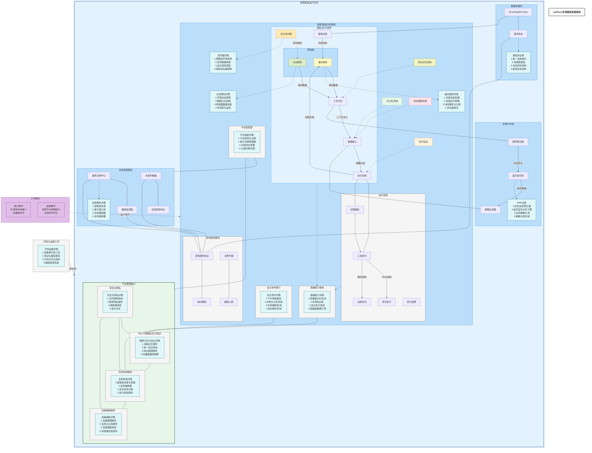

```mermaid
graph TB
    %% 总标题
    title[<b>JetPave 多智能体系统架构</b>]
    
    %% 主要区域划分
    subgraph MAS["多智能体运行空间"]
        direction TB
        
        %% 智能体通讯区域
        subgraph Communicate["智能体通讯"]
            direction LR
            Message["API/WS/gRPC/MQ"] --- CommProtocol["通讯协议"]
            
            %% 通信协议栈详情
            CommStackDetail["通信协议栈<br>1.统一消息格式<br>2.多通道通信<br>3.状态同步机制<br>4.断连恢复机制"]
            CommProtocol -.-> CommStackDetail
        end
        
        %% 全局RPE池区域
        subgraph GlobalRPE["全局RPE池"]
            direction LR
            FAgg["联邦聚合器"] -->|加密聚合| DeltaDB["差异信号库"]
            DeltaDB -->|联邦策略| FPolicy["策略生成器"]
            
            %% 全局RPE详情
            RPEDetail["RPE详情<br>1.安全加密聚合器<br>2.差异信号分析引擎<br>3.全局策略生成<br>4.策略分发机制"]
            DeltaDB -.-> RPEDetail
        end
        
        %% 智能体运行时架构区域
        subgraph Agent["智能体运行时架构"]
            direction TB

            %% 感知-执行闭环
            subgraph Loop["感知-执行闭环"]
                direction LR
                
                %% 感知层细分
                subgraph Percept["感知层"]
                    direction TB
                    PassiveReceive["被动接收"] 
                    ActiveSense["主动感知"]
                end
                
                AgentTimer["自主定时器"] -.->|"定时触发"| ActiveSense
                AgentMessage["接收消息"] -->|外部消息| PassiveReceive
                PassiveReceive -->|"感知数据"| WM["工作记忆"]
                ActiveSense -->|"感知数据"| WM
                WM -->|上下文注入| Reason["推理核心"]
                Reason -->|策略生成| Executor["执行系统"]
                Executor -->|结果反馈| PassiveReceive
            end
            
            %% 感知组件细分详情
            PassiveDetail["被动接收详情<br>1.外部消息处理<br>2.消息队列管理<br>3.消息解析与分类<br>4.优先级排序"]
            ActiveDetail["主动感知详情<br>1.环境状态探测<br>2.数据主动拉取<br>3.传感器数据采集<br>4.环境变化监测"]
            PassiveReceive -.-> PassiveDetail
            ActiveSense -.-> ActiveDetail
            
            %% 定时器详情
            TimerDetail["定时器详情<br>1.周期性环境探测<br>2.定时数据获取<br>3.自主感知调度<br>4.感知优先级控制"]
            AgentTimer -.-> TimerDetail
            
            %% 执行系统
            subgraph Execution["执行系统"]
                direction LR
                Tool["工具执行"] -->|Shell调用| Command["命令执行"]
                Tool -->|服务调用| API["远程访问"]
                Orchestrator["流程解析"] --> Tool
                ToolResult["执行结果"]
            end
            
            %% 智能体基础能力
            subgraph CoreCapabilities["基础能力模块"]
                direction TB
                CoreCapDetail["基础能力详情<br>1.轻量级记忆系统<br>2.本地知识库<br>3.自主执行系统<br>4.轻量级推理引擎"]
            end
            
            %% 自主协作能力
            subgraph SelfCooperation["自主协作能力"]
                direction TB
                SelfCoopDetail["自主协作详情<br>1.P2P通信模块<br>2.本地元认知系统<br>3.本地激励系统<br>4.目标维护机制"]
            end
            
            %% 平台适配层
            subgraph PlatformAdapter["平台适配层"]
                direction TB
                PlatformAdapterDetail["平台适配详情<br>1.平台发现与注册<br>2.能力切换管理器<br>3.状态同步管理<br>4.云端功能代理"]
            end
            
            %% 发现模块
            subgraph Discovery["本地发现模块"]
                direction LR
                Reg["注册代理"] --- Health["健康上报"]
                DSProtocol["发现服务协议"] --- Resolver["端点解析"]
            end
            
            %% 核心模块
            Meta["元认知系统"]
            Memory["知识记忆系统"]
            Incentive["动态激励系统"]
            Verify["执行验证"]
            
            %% 内部连接
            Executor --- Tool
            Executor --- Orchestrator
            Memory -.-> WM
            Meta -.-> Reason
            Incentive -.-> Reason
            Verify -.-> Executor
            Loop -.-> CoreCapabilities
            Execution -.-> CoreCapabilities
        end

        %% 全局发现服务
        subgraph DiscoveryService["全局发现服务"]
            direction LR
            Registry["服务注册中心"] --- Check["健康监测器"]
            Balancer["负载均衡器"] --- GDSProtocol["全局发现协议"]
            
            %% 全局发现服务详情
            DSDetail["发现服务详情<br>1.智能体目录<br>2.能力索引库<br>3.状态跟踪器<br>4.任务编排器"]
            Registry -.-> DSDetail
        end
        
        %% 平台枢纽区域
        subgraph Platform["平台枢纽核心"]
            direction TB
            
            %% 中心化增强记忆与知识
            subgraph EnhancedKM["中心化增强记忆与知识"]
                direction LR
                EKMDetail["增强记忆与知识详情<br>1.高级记忆服务<br>2.统一知识系统<br>3.知识图谱服务<br>4.向量数据库集群"]
            end
            
            %% 全局协调服务
            subgraph GlobalCoord["全局协调服务"]
                direction LR
                GCDetail["全局协调详情<br>1.智能体注册与管理<br>2.任务编排器<br>3.复杂任务分解<br>4.执行监控服务"]
            end
            
            %% 高级辅助服务
            subgraph AdvServices["高级辅助服务"]
                direction LR
                ASDetail["高级辅助详情<br>1.高级推理服务<br>2.全局元认知服务<br>3.高级激励系统<br>4.系统级反思机制"]
            end
            
            %% 安全与隐私
            subgraph Security["安全与隐私"]
                direction LR
                SecurityDetail["安全与隐私详情<br>1.访问控制系统<br>2.联邦隐私保护<br>3.端到端加密<br>4.审计日志"]
            end
            
            %% 平台组件连接关系
            EnhancedKM --- GlobalCoord
            GlobalCoord --- AdvServices
            Security --- EnhancedKM
            Security --- GlobalCoord
            Security --- AdvServices
        end
        
        %% 区域间连接
        Message --- AgentMessage
        CommProtocol --- DSProtocol
        WM --- FAgg
        Reason --- FPolicy
        Registry --- DSProtocol
        Check --- DSProtocol
        Balancer --- DSProtocol
        PlatformAdapter --- DiscoveryService
        PlatformAdapter --- Platform
        CoreCapabilities --- EnhancedKM
        SelfCooperation --- GlobalCoord
    end
    
    %% 开发与运维工具（外部支持）
    subgraph DevOps["开发与运维工具"]
        direction TB
        DevOpsDetail["开发运维详情<br>1.智能体开发工具<br>2.测试与模拟框架<br>3.分布式日志系统<br>4.健康监控系统"]
    end
    
    %% 模式切换说明
    subgraph Modes["工作模式"]
        direction TB
        M1["独立模式:<br>仅使用本地能力<br>轻量级协作"]
        M2["连接模式:<br>使用平台增强能力<br>全局协作优化"]
    end
    
    %% 外部关系
    DevOps -->|"开发支持"| MAS
    Modes -.->|"运行模式"| Agent
    
    %% 样式设置
    classDef titleClass fill:#f9f9f9,stroke:#333,stroke-width:2px,font-weight:bold
    classDef mainAreaClass fill:#e3f2fd,stroke:#0d47a1,stroke-width:2px
    classDef loopClass fill:#e3f2fd,stroke:#2196f3,stroke-width:1px
    classDef platformClass fill:#e8f5e9,stroke:#1b5e20,stroke-width:2px
    classDef subAreaClass fill:#bbdefb,stroke:#1976d2,stroke-width:1px
    classDef componentClass fill:#f5f5f5,stroke:#616161,stroke-width:1px
    classDef metaClass fill:#e8f5e9,stroke:#81c784,stroke-width:1px
    classDef memoryClass fill:#f0f4c3,stroke:#827717,stroke-width:1px
    classDef incentiveClass fill:#fce4ec,stroke:#f48fb1,stroke-width:1px
    classDef verifyClass fill:#fff3e0,stroke:#ffb74d,stroke-width:1px
    classDef modesClass fill:#e1bee7,stroke:#8e24aa,stroke-width:1px,font-style:italic
    classDef detailClass fill:#e0f7fa,stroke:#006064,stroke-width:1px
    classDef timerClass fill:#ffecb3,stroke:#ff6f00,stroke-width:1px
    classDef activeClass fill:#dcedc8,stroke:#689f38,stroke-width:1px
    classDef passiveClass fill:#fff9c4,stroke:#fbc02d,stroke-width:1px
    
    class title titleClass
    class MAS mainAreaClass
    class Loop loopClass
    class Percept subAreaClass
    class Platform platformClass
    class Communicate,GlobalRPE,Agent,DiscoveryService subAreaClass
    class DevOps,Execution,Discovery,EnhancedKM,GlobalCoord,AdvServices,Security,CoreCapabilities,SelfCooperation,PlatformAdapter componentClass
    class Meta metaClass
    class Memory memoryClass
    class Incentive incentiveClass
    class Verify verifyClass
    class Modes,M1,M2 modesClass
    class CommStackDetail,RPEDetail,CoreCapDetail,SelfCoopDetail,PlatformAdapterDetail,DSDetail,EKMDetail,GCDetail,ASDetail,SecurityDetail,DevOpsDetail,TimerDetail,PassiveDetail,ActiveDetail detailClass
    class AgentTimer timerClass
    class ActiveSense activeClass
    class PassiveReceive passiveClass
```