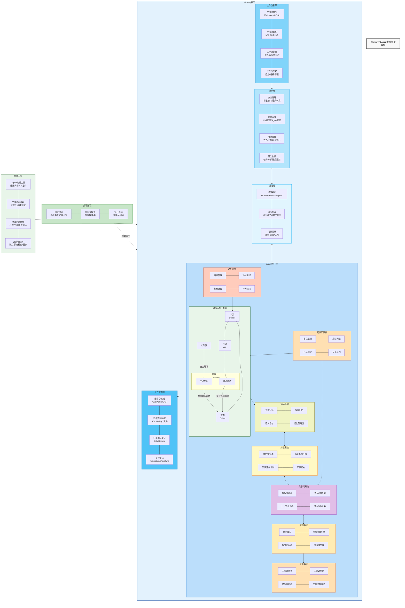

```mermaid
graph TB
    %% 总标题
    title[<b>Mimicry 多Agent协作框架架构</b>]
    
    %% 主要区域划分
    subgraph Framework["Mimicry框架"]
        direction TB
        
        %% 核心运行时
        subgraph Runtime["Agent运行时"]
            direction TB
            
            %% OODA循环
            subgraph OODALoop["OODA循环引擎"]
                direction LR
                
                %% 观察细分为主动和被动两部分
                subgraph Observe["观察<br>Observe"]
                    direction TB
                    PassiveReceive["被动接收"] 
                    ActiveSense["主动感知"]
                end
                
                Timer["定时器"] -.->|"自主触发"| ActiveSense
                PassiveReceive -->|"整合感知数据"| Orient["定向<br>Orient"]
                ActiveSense -->|"整合感知数据"| Orient
                Orient --> Decide["决策<br>Decide"] --> Act["行动<br>Act"] 
                Act --> PassiveReceive
            end
            
            %% 记忆系统
            subgraph Memory["记忆系统"]
                direction LR
                WorkingMemory["工作记忆"] --- EpisodicMemory["情景记忆"]
                SemanticMemory["语义记忆"] --- MemoryManager["记忆管理器"]
            end
            
            %% 知识系统
            subgraph Knowledge["知识系统"]
                direction LR
                LocalKB["本地知识库"] --- KnowledgeRetrieval["知识检索引擎"]
                KnowledgeUpdate["知识更新机制"] --- KnowledgeCache["知识缓存"]
            end
            
            %% 提示词系统
            subgraph Prompt["提示词系统"]
                direction LR
                TemplateManager["模板管理器"] --- PromptAssembler["提示词装配器"]
                ContextInjector["上下文注入器"] --- PromptOptimizer["提示词优化器"]
            end
            
            %% 推理系统
            subgraph Reasoning["推理系统"]
                direction LR
                LLMInterface["LLM接口"] --- RuleEngine["规则推理引擎"]
                PatternMatcher["模式匹配器"] --- ReasoningChain["推理链生成"]
            end
            
            %% 工具系统
            subgraph Tools["工具系统"]
                direction LR
                ToolRegistry["工具注册表"] --- ToolCaller["工具调用器"]
                ResultParser["结果解析器"] --- ToolSelector["工具选择算法"]
            end
            
            %% 元认知系统
            subgraph MetaCognition["元认知系统"]
                direction LR
                SelfMonitor["自我监控"] --- StrategyAdjuster["策略调整"]
                GoalMaintainer["目标维护"] --- ReflectionMechanism["反思机制"]
            end
            
            %% 动机系统
            subgraph Motivation["动机系统"]
                direction LR
                GoalManager["目标管理"] --- MotiveGenerator["动机生成"]
                RewardCalculator["奖励计算"] --- BehaviorReinforcer["行为强化"]
            end
            
            %% 连接关系
            OODALoop --> Memory
            Memory <--> Knowledge
            Knowledge <--> Prompt
            Prompt <--> Reasoning
            Reasoning --> Tools
            MetaCognition --> OODALoop
            MetaCognition -.-> Prompt
            Motivation --> Decide
        end
        
        %% 通信层
        subgraph Communication["通信层"]
            direction TB
            
            %% 通信接口
            CommInterfaces["通信接口<br>REST/WebSocket/gRPC"]
            
            %% 通信协议
            CommProtocol["通信协议<br>消息格式/路由/加密"]
            
            %% 消息总线
            MessageBus["消息总线<br>发布-订阅/队列"]
            
            %% 连接关系
            CommInterfaces --- CommProtocol --- MessageBus
        end
        
        %% 协作层
        subgraph Collaboration["协作层"]
            direction TB
            
            %% 协议处理
            ProtocolHandler["协议处理<br>标准接口/格式转换"]
            
            %% 状态同步
            StateSync["状态同步<br>环境状态/Agent状态"]
            
            %% 角色管理
            RoleManager["角色管理<br>角色分配/职责定义"]
            
            %% 任务协调
            TaskCoordinator["任务协调<br>任务分解/进度跟踪"]
            
            %% 连接关系
            ProtocolHandler --- StateSync --- RoleManager --- TaskCoordinator
        end
        
        %% 工作流引擎
        subgraph Workflow["工作流引擎"]
            direction TB
            
            %% 工作流定义
            FlowDefinition["工作流定义<br>JSON/YAML/DSL"]
            
            %% 工作流解析
            FlowParser["工作流解析<br>解析器/验证器"]
            
            %% 工作流执行
            FlowExecutor["工作流执行<br>状态机/事件处理"]
            
            %% 工作流监控
            FlowMonitor["工作流监控<br>日志/指标/警报"]
            
            %% 连接关系
            FlowDefinition --- FlowParser --- FlowExecutor --- FlowMonitor
        end
        
        %% 平台适配
        subgraph Platform["平台适配层"]
            direction TB
            
            %% 云平台集成
            CloudIntegration["云平台集成<br>AWS/Azure/GCP"]
            
            %% 数据存储适配
            StorageAdapter["数据存储适配<br>SQL/NoSQL/文件"]
            
            %% 容器编排集成
            ContainerOrchestration["容器编排集成<br>K8s/Docker"]
            
            %% 监控集成
            MonitoringIntegration["监控集成<br>Prometheus/Grafana"]
            
            %% 连接关系
            CloudIntegration --- StorageAdapter --- ContainerOrchestration --- MonitoringIntegration
        end
    end
    
    %% 开发工具
    subgraph DevTools["开发工具"]
        direction TB
        
        %% Agent构建工具
        AgentBuilder["Agent构建工具<br>模板/向导/IDE插件"]
        
        %% 工作流设计器
        WorkflowDesigner["工作流设计器<br>可视化编辑/测试"]
        
        %% 模拟测试环境
        SimulationEnvironment["模拟测试环境<br>环境模拟/场景测试"]
        
        %% 调试与诊断
        Debugger["调试与诊断<br>断点/状态检查/日志"]
        
        %% 连接关系
        AgentBuilder --- WorkflowDesigner --- SimulationEnvironment --- Debugger
    end
    
    %% 部署选项
    subgraph Deployment["部署选项"]
        direction LR
        
        %% 独立模式
        Standalone["独立模式<br>单机部署/边缘计算"]
        
        %% 分布式模式
        Distributed["分布式模式<br>微服务/集群"]
        
        %% 混合模式
        Hybrid["混合模式<br>边缘-云协同"]
        
        %% 连接关系
        Standalone --- Distributed --- Hybrid
    end
    
    %% 连接关系
    Communication <--> Runtime
    Collaboration <--> Communication
    Workflow --> Collaboration
    Platform <--> Framework
    DevTools -->|"开发支持"| Framework
    Deployment -.->|"部署方式"| Framework
    
    %% 样式设置
    classDef titleClass fill:#f9f9f9,stroke:#333,stroke-width:2px,font-weight:bold
    classDef frameworkClass fill:#e3f2fd,stroke:#0d47a1,stroke-width:2px
    classDef runtimeClass fill:#bbdefb,stroke:#1976d2,stroke-width:1px
    classDef communicationClass fill:#e1f5fe,stroke:#03a9f4,stroke-width:1px
    classDef collaborationClass fill:#b3e5fc,stroke:#039be5,stroke-width:1px
    classDef workflowClass fill:#81d4fa,stroke:#0288d1,stroke-width:1px
    classDef platformClass fill:#4fc3f7,stroke:#0277bd,stroke-width:1px
    classDef devToolsClass fill:#e8f5e9,stroke:#1b5e20,stroke-width:1px
    classDef deploymentClass fill:#c8e6c9,stroke:#388e3c,stroke-width:1px
    classDef loopClass fill:#e8f5e9,stroke:#1b5e20,stroke-width:1px
    classDef memoryClass fill:#f0f4c3,stroke:#827717,stroke-width:1px
    classDef knowledgeClass fill:#fff9c4,stroke:#f57f17,stroke-width:1px
    classDef promptClass fill:#e1bee7,stroke:#8e24aa,stroke-width:1px
    classDef reasoningClass fill:#ffecb3,stroke:#ff6f00,stroke-width:1px
    classDef toolsClass fill:#ffe0b2,stroke:#e65100,stroke-width:1px
    classDef metaClass fill:#ffe0b2,stroke:#e65100,stroke-width:1px
    classDef motivationClass fill:#ffccbc,stroke:#bf360c,stroke-width:1px
    
    class title titleClass
    class Framework frameworkClass
    class Runtime runtimeClass
    class Communication communicationClass
    class Collaboration collaborationClass
    class Workflow workflowClass
    class Platform platformClass
    class DevTools devToolsClass
    class Deployment deploymentClass
    class OODALoop loopClass
    class Memory memoryClass
    class Knowledge knowledgeClass
    class Prompt promptClass
    class Reasoning reasoningClass
    class Tools toolsClass
    class MetaCognition metaClass
    class Motivation motivationClass
```