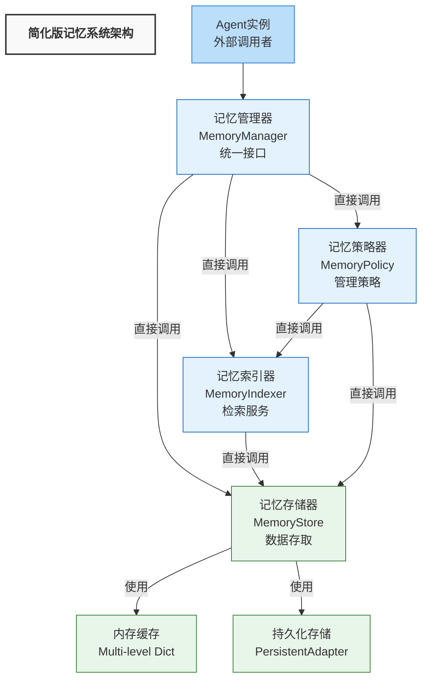

```mermaid
graph TD
    %% 总标题
    title[<b>简化版记忆系统架构</b>]
    
    %% 外部接口
    Agent["Agent实例<br>外部调用者"]
    
    %% 核心模块
    MM["记忆管理器<br>MemoryManager<br>统一接口"]
    MS["记忆存储器<br>MemoryStore<br>数据存取"]
    MI["记忆索引器<br>MemoryIndexer<br>检索服务"]
    MP["记忆策略器<br>MemoryPolicy<br>管理策略"]
    
    %% 存储层
    Cache["内存缓存<br>Multi-level Dict"]
    Persistent["持久化存储<br>PersistentAdapter"]
    
    %% 关系定义 - 直接调用关系
    Agent --> MM
    MM -->|"直接调用"| MS
    MM -->|"直接调用"| MI
    MM -->|"直接调用"| MP
    MI -->|"直接调用"| MS
    MP -->|"直接调用"| MS
    MP -->|"直接调用"| MI
    MS -->|"使用"| Cache
    MS -->|"使用"| Persistent
    
    %% 样式设置
    classDef titleClass fill:#f9f9f9,stroke:#333,stroke-width:2px,font-weight:bold
    classDef agentClass fill:#bbdefb,stroke:#1976d2,stroke-width:1px
    classDef moduleClass fill:#e3f2fd,stroke:#1565c0,stroke-width:1px
    classDef storeClass fill:#e8f5e9,stroke:#2e7d32,stroke-width:1px
    
    class title titleClass
    class Agent agentClass
    class MM,MI,MP moduleClass
    class MS,Cache,Persistent storeClass
```