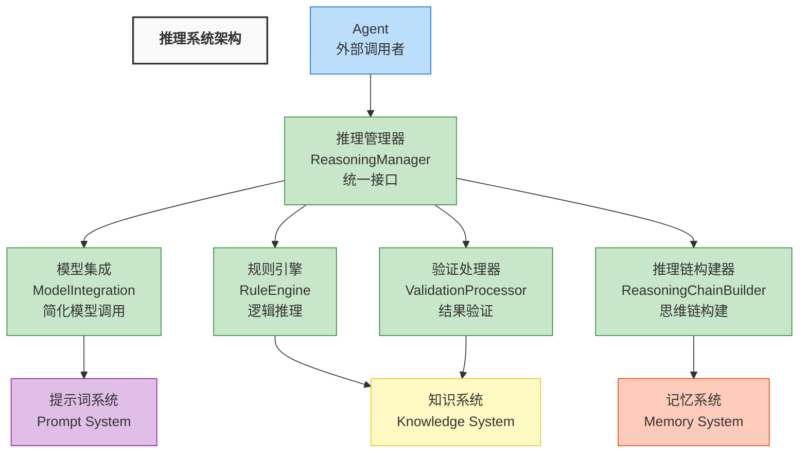

```mermaid
graph TB
    %% 总标题
    title[<b>推理系统架构</b>]
    
    %% 外部接口
    Agent["Agent<br>外部调用者"]
    Knowledge["知识系统<br>Knowledge System"]
    Memory["记忆系统<br>Memory System"]
    Prompt["提示词系统<br>Prompt System"]
    
    %% 核心模块
    RM["推理管理器<br>ReasoningManager<br>统一接口"]
    MC["模型集成<br>ModelIntegration<br>简化模型调用"]
    RE["规则引擎<br>RuleEngine<br>逻辑推理"]
    RC["推理链构建器<br>ReasoningChainBuilder<br>思维链构建"]
    VP["验证处理器<br>ValidationProcessor<br>结果验证"]
    
    %% 关系定义
    Agent --> RM
    RM --> MC
    RM --> RE
    RM --> RC
    RM --> VP
    MC --> Prompt
    RE --> Knowledge
    VP --> Knowledge
    RC --> Memory
    
    %% 样式设置
    classDef titleClass fill:#f9f9f9,stroke:#333,stroke-width:2px,font-weight:bold
    classDef agentClass fill:#bbdefb,stroke:#1976d2,stroke-width:1px
    classDef knowledgeClass fill:#fff9c4,stroke:#fbc02d,stroke-width:1px
    classDef memoryClass fill:#ffccbc,stroke:#e64a19,stroke-width:1px
    classDef promptClass fill:#e1bee7,stroke:#8e24aa,stroke-width:1px
    classDef moduleClass fill:#c8e6c9,stroke:#388e3c,stroke-width:1px
    
    class title titleClass
    class Agent agentClass
    class Knowledge knowledgeClass
    class Memory memoryClass
    class Prompt promptClass
    class RM,MC,RE,RC,VP moduleClass
```