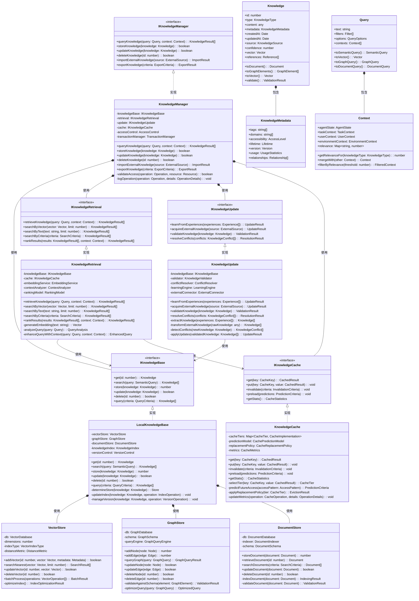

```mermaid
classDiagram
    %% 接口定义
    class IKnowledgeManager {
        <<interface>>
        +queryKnowledge(query: Query, context: Context): KnowledgeResult[]
        +storeKnowledge(knowledge: Knowledge): boolean
        +updateKnowledge(knowledge: Knowledge): boolean
        +deleteKnowledge(id: number): boolean
        +importExternalKnowledge(source: ExternalSource): ImportResult
        +exportKnowledge(criteria: ExportCriteria): ExportResult
    }
    
    class IKnowledgeBase {
        <<interface>>
        +get(id: number): Knowledge
        +search(query: SemanticQuery): Knowledge[]
        +store(knowledge: Knowledge): number
        +update(knowledge: Knowledge): boolean
        +delete(id: number): boolean
        +query(criteria: QueryCriteria): Knowledge[]
    }
    
    class IKnowledgeRetrieval {
        <<interface>>
        +retrieveKnowledge(query: Query, context: Context): KnowledgeResult[]
        +searchByVector(vector: Vector, limit: number): KnowledgeResult[]
        +searchByText(text: string, limit: number): KnowledgeResult[]
        +searchByCriteria(criteria: SearchCriteria): KnowledgeResult[]
        +rankResults(results: KnowledgeResult[], context: Context): KnowledgeResult[]
    }
    
    class IKnowledgeUpdate {
        <<interface>>
        +learnFromExperiences(experiences: Experience[]): UpdateResult
        +acquireExternalKnowledge(source: ExternalSource): UpdateResult
        +validateKnowledge(knowledge: Knowledge): ValidationResult
        +resolveConflicts(conflicts: KnowledgeConflict[]): ResolutionResult
    }
    
    class IKnowledgeCache {
        <<interface>>
        +get(key: CacheKey): CachedResult
        +put(key: CacheKey, value: CachedResult): void
        +invalidate(criteria: InvalidationCriteria): void
        +preload(predictions: PredictionCriteria): void
        +getStats(): CacheStatistics
    }
    
    %% 实现类
    class KnowledgeManager {
        -knowledgeBase: IKnowledgeBase
        -retrieval: IKnowledgeRetrieval
        -update: IKnowledgeUpdate
        -cache: IKnowledgeCache
        -accessControl: AccessControl
        -transactionManager: TransactionManager
        +queryKnowledge(query: Query, context: Context): KnowledgeResult[]
        +storeKnowledge(knowledge: Knowledge): boolean
        +updateKnowledge(knowledge: Knowledge): boolean
        +deleteKnowledge(id: number): boolean
        +importExternalKnowledge(source: ExternalSource): ImportResult
        +exportKnowledge(criteria: ExportCriteria): ExportResult
        -validateAccess(operation: Operation, resource: Resource): boolean
        -logOperation(operation: Operation, details: OperationDetails): void
    }
    
    class LocalKnowledgeBase {
        -vectorStore: VectorStore
        -graphStore: GraphStore
        -documentStore: DocumentStore
        -knowledgeIndex: KnowledgeIndex
        -versionControl: VersionControl
        +get(id: number): Knowledge
        +search(query: SemanticQuery): Knowledge[]
        +store(knowledge: Knowledge): number
        +update(knowledge: Knowledge): boolean
        +delete(id: number): boolean
        +query(criteria: QueryCriteria): Knowledge[]
        -determineStore(knowledge: Knowledge): Store
        -updateIndex(knowledge: Knowledge, operation: IndexOperation): void
        -manageVersion(knowledge: Knowledge, operation: VersionOperation): void
    }
    
    class KnowledgeRetrieval {
        -knowledgeBase: IKnowledgeBase
        -cache: IKnowledgeCache
        -embeddingService: EmbeddingService
        -contextAnalyzer: ContextAnalyzer
        -rankingModel: RankingModel
        +retrieveKnowledge(query: Query, context: Context): KnowledgeResult[]
        +searchByVector(vector: Vector, limit: number): KnowledgeResult[]
        +searchByText(text: string, limit: number): KnowledgeResult[]
        +searchByCriteria(criteria: SearchCriteria): KnowledgeResult[]
        +rankResults(results: KnowledgeResult[], context: Context): KnowledgeResult[]
        -generateEmbedding(text: string): Vector
        -analyzeQuery(query: Query): QueryAnalysis
        -enhanceQueryWithContext(query: Query, context: Context): EnhancedQuery
    }
    
    class KnowledgeUpdate {
        -knowledgeBase: IKnowledgeBase
        -validator: KnowledgeValidator
        -conflictResolver: ConflictResolver
        -learningEngine: LearningEngine
        -externalConnector: ExternalConnector
        +learnFromExperiences(experiences: Experience[]): UpdateResult
        +acquireExternalKnowledge(source: ExternalSource): UpdateResult
        +validateKnowledge(knowledge: Knowledge): ValidationResult
        +resolveConflicts(conflicts: KnowledgeConflict[]): ResolutionResult
        -extractKnowledge(experiences: Experience[]): Knowledge[]
        -transformExternalKnowledge(rawKnowledge: any): Knowledge[]
        -detectConflicts(newKnowledge: Knowledge): KnowledgeConflict[]
        -applyUpdates(validatedKnowledge: Knowledge[]): UpdateResult
    }
    
    class KnowledgeCache {
        -cacheTiers: Map~CacheTier, CacheImplementation~
        -predictionModel: CachePredictionModel
        -replacementPolicy: CacheReplacementPolicy
        -metrics: CacheMetrics
        +get(key: CacheKey): CachedResult
        +put(key: CacheKey, value: CachedResult): void
        +invalidate(criteria: InvalidationCriteria): void
        +preload(predictions: PredictionCriteria): void
        +getStats(): CacheStatistics
        -selectTier(key: CacheKey, value: CachedResult): CacheTier
        -predictFutureAccess(accessPattern: AccessPattern): PredictionCriteria
        -applyReplacementPolicy(tier: CacheTier): EvictionResult
        -updateMetrics(operation: CacheOperation, details: OperationDetails): void
    }
    
    %% 存储类
    class VectorStore {
        -db: VectorDatabase
        -dimensions: number
        -indexType: VectorIndexType
        -distanceMetric: DistanceMetric
        +addVector(id: number, vector: Vector, metadata: Metadata): boolean
        +searchNearest(vector: Vector, limit: number): SearchResult[]
        +updateVector(id: number, vector: Vector): boolean
        +deleteVector(id: number): boolean
        +batchProcess(operations: VectorOperation[]): BatchResult
        -optimizeIndex(): IndexOptimizationResult
    }
    
    class GraphStore {
        -db: GraphDatabase
        -schema: GraphSchema
        -queryEngine: GraphQueryEngine
        +addNode(node: Node): number
        +addEdge(edge: Edge): number
        +queryGraph(query: GraphQuery): GraphQueryResult
        +updateNode(node: Node): boolean
        +updateEdge(edge: Edge): boolean
        +deleteNode(id: number): boolean
        +deleteEdge(id: number): boolean
        -validateAgainstSchema(element: GraphElement): ValidationResult
        -optimizeQuery(query: GraphQuery): OptimizedQuery
    }
    
    class DocumentStore {
        -db: DocumentDatabase
        -indexer: DocumentIndexer
        -schema: DocumentSchema
        +storeDocument(document: Document): number
        +retrieveDocument(id: number): Document
        +searchDocuments(criteria: SearchCriteria): Document[]
        +updateDocument(document: Document): boolean
        +deleteDocument(id: number): boolean
        -indexDocument(document: Document): IndexingResult
        -validateDocument(document: Document): ValidationResult
    }
    
    %% 实用类
    class Knowledge {
        +id: number
        +type: KnowledgeType
        +content: any
        +metadata: KnowledgeMetadata
        +createdAt: Date
        +updatedAt: Date
        +source: KnowledgeSource
        +confidence: number
        +vector: Vector
        +references: Reference[]
        +toDocument(): Document
        +toGraphElements(): GraphElement[]
        +toVector(): Vector
        +validate(): ValidationResult
    }
    
    class KnowledgeMetadata {
        +tags: string[]
        +domains: string[]
        +accessibility: AccessLevel
        +lifetime: Lifetime
        +version: Version
        +usage: UsageStatistics
        +relationships: Relationship[]
    }
    
    class Query {
        +text: string
        +filters: Filter[]
        +options: QueryOptions
        +contexts: Context[]
        +toSemanticQuery(): SemanticQuery
        +toVector(): Vector
        +toGraphQuery(): GraphQuery
        +toDocumentQuery(): DocumentQuery
    }
    
    class Context {
        +agentState: AgentState
        +taskContext: TaskContext
        +userContext: UserContext
        +environmentContext: EnvironmentContext
        +relevance: Map~string, number~
        +getRelevanceFor(knowledgeType: KnowledgeType): number
        +mergeWith(other: Context): Context
        +filterByRelevance(threshold: number): FilteredContext
    }
    
    %% 关系定义
    IKnowledgeManager <|.. KnowledgeManager : 实现
    IKnowledgeBase <|.. LocalKnowledgeBase : 实现
    IKnowledgeRetrieval <|.. KnowledgeRetrieval : 实现
    IKnowledgeUpdate <|.. KnowledgeUpdate : 实现
    IKnowledgeCache <|.. KnowledgeCache : 实现
    
    KnowledgeManager *-- IKnowledgeBase : 使用
    KnowledgeManager *-- IKnowledgeRetrieval : 使用
    KnowledgeManager *-- IKnowledgeUpdate : 使用
    KnowledgeManager *-- IKnowledgeCache : 使用
    
    LocalKnowledgeBase *-- VectorStore : 使用
    LocalKnowledgeBase *-- GraphStore : 使用
    LocalKnowledgeBase *-- DocumentStore : 使用
    
    KnowledgeRetrieval --> IKnowledgeBase : 使用
    KnowledgeRetrieval --> IKnowledgeCache : 使用
    
    KnowledgeUpdate --> IKnowledgeBase : 使用
    
    Knowledge *-- KnowledgeMetadata : 包含
    Query *-- Context : 包含
```