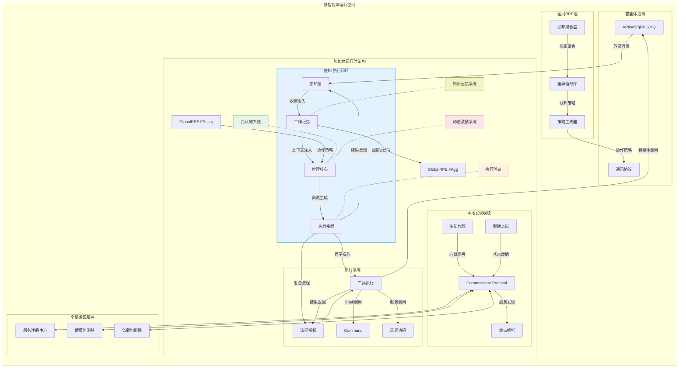

```mermaid
graph TD
    %% 保持用户原图结构的基础增强版
    subgraph MAS[多智能体运行空间]
        direction TB
        
        %% 用户原有通信层保持不变
        subgraph Communicate[智能体通讯]
            direction LR
            Message[API/WS/gRPC/MQ]
            Protocol[通讯协议]
        end

        %% 新增全局RPE池
        subgraph GlobalRPE[全局RPE池]
            direction LR
            FAgg[联邦聚合器] -->|加密聚合| DeltaDB[差异信号库]
            DeltaDB -->|联邦策略| FPolicy[策略生成器]
            FPolicy -->|协作策略| Protocol
        end

        %% 用户原有智能体架构保持不变
        subgraph Agent[智能体运行时架构]
            direction TB

            %% 保持原有感知-执行闭环
            subgraph Loop[感知-执行闭环]
                direction LR
                Message --> |外部消息| Percept
                Percept[感知层] -->|多源输入| WM[工作记忆]
                WM -->|上下文注入| Reason[推理核心]
                Reason -->|策略生成| Executor[执行系统]
                Executor -->|结果反馈| Percept
            end

            %% 新增联邦学习接口
            WM -->|加密Δ信号| GlobalRPE.FAgg
            GlobalRPE.FPolicy -->|协作策略| Reason

            %% 保持原有执行系统
            subgraph Execution[执行系统]
                direction LR
                Executor -->|原子操作| Tool[工具执行] --> |智能体调用| Message
                Orchestrator --> Tool
                Tool[工具执行] --> |Shell调用| Command
                Tool[工具执行] -->|服务调用| API[远程访问]
                Executor -->|组合流程| Orchestrator[流程解析]
                Tool[工具执行] --> |结果返回| Orchestrator
            end

            %% 新增发现服务对接
            subgraph Discovery[本地发现模块]
                direction TB
                Reg[注册代理] -->|心跳信号| Communicate.Protocol
                Health[健康上报] -->|状态数据| Communicate.Protocol
                Communicate.Protocol -->|服务发现| Resolver[端点解析]
            end

            %% 保持原有其他模块
            Meta[元认知系统]-.-Reason
            Memory[知识记忆系统]-.-WM
            Incentive[动态激励系统]-.-Reason
            Verify[执行验证]-.-Executor
        end

        %% 新增全局发现服务
        subgraph DiscoveryService[全局发现服务]
            direction LR
            Registry[服务注册中心]
            Check[健康监测器]
            Balancer[负载均衡器]
            Communicate.Protocol <--> Registry
            Communicate.Protocol <--> Check
            Communicate.Protocol <--> Balancer
        end
    end

    %% 样式继承原图设定
    classDef loop fill:#e3f2fd,stroke:#2196f3;
    classDef meta fill:#e8f5e9,stroke:#81c784;
    classDef memory fill:#f0f4c3,stroke:#827717;
    classDef incentive fill:#fce4ec,stroke:#f48fb1;
    classDef verify fill:#fff3e0,stroke:#ffb74d;
    class Loop loop;
    class Meta meta;
    class Memory memory;
    class Incentive incentive;
    class Verify verify;
```