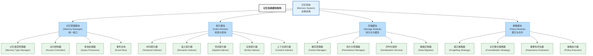

```mermaid
graph TB
    %% 总标题
    title[<b>记忆系统模块架构</b>]
    
    %% 核心模块
    MemorySystem["记忆系统<br>(Memory System)<br>总体协调"]
    
    %% 一级模块
    MemoryManager["记忆管理模块<br>(Memory Manager)<br>统一接口"]
    IndexModule["索引模块<br>(Index Module)<br>检索与查询"]
    StorageModule["存储模块<br>(Storage Module)<br>持久化与缓存"]
    PolicyModule["策略模块<br>(Policy Module)<br>遗忘与合并"]
    
    %% 二级模块 - 记忆管理器子模块
    MemoryTypeManager["记忆类型管理器<br>(Memory Type Manager)"]
    AccessController["访问控制器<br>(Access Controller)"]
    QueryProcessor["查询处理器<br>(Query Processor)"]
    EventBus["事件总线<br>(Event Bus)"]
    
    %% 二级模块 - 索引模块子模块
    TemporalIndexer["时间索引器<br>(Temporal Indexer)"]
    SemanticIndexer["语义索引器<br>(Semantic Indexer)"]
    SpatialIndexer["空间索引器<br>(Spatial Indexer)"]
    EntityIndexer["实体索引器<br>(Entity Indexer)"]
    ContextIndexer["上下文索引器<br>(Context Indexer)"]
    
    %% 二级模块 - 存储模块子模块
    CacheManager["缓存管理器<br>(Cache Manager)"]
    PersistenceManager["持久化管理器<br>(Persistence Manager)"]
    SerializationService["序列化服务<br>(Serialization Service)"]
    DataMigrator["数据迁移器<br>(Data Migrator)"]
    
    %% 二级模块 - 策略模块子模块
    ForgettingStrategy["遗忘策略器<br>(Forgetting Strategy)"]
    ConsolidationStrategy["记忆整合策略器<br>(Consolidation Strategy)"]
    ImportanceEvaluator["重要性评估器<br>(Importance Evaluator)"]
    PolicyExecutor["策略执行器<br>(Policy Executor)"]
    
    %% 关系定义 - 一级关系
    MemorySystem --> MemoryManager
    MemorySystem --> IndexModule
    MemorySystem --> StorageModule
    MemorySystem --> PolicyModule
    
    %% 关系定义 - 记忆管理器子模块
    MemoryManager --> MemoryTypeManager
    MemoryManager --> AccessController
    MemoryManager --> QueryProcessor
    MemoryManager --> EventBus
    
    %% 关系定义 - 索引模块子模块
    IndexModule --> TemporalIndexer
    IndexModule --> SemanticIndexer
    IndexModule --> SpatialIndexer
    IndexModule --> EntityIndexer
    IndexModule --> ContextIndexer
    
    %% 关系定义 - 存储模块子模块
    StorageModule --> CacheManager
    StorageModule --> PersistenceManager
    StorageModule --> SerializationService
    StorageModule --> DataMigrator
    
    %% 关系定义 - 策略模块子模块
    PolicyModule --> ForgettingStrategy
    PolicyModule --> ConsolidationStrategy
    PolicyModule --> ImportanceEvaluator
    PolicyModule --> PolicyExecutor
    
    %% 样式设置
    classDef titleClass fill:#f9f9f9,stroke:#333,stroke-width:2px,font-weight:bold
    classDef systemClass fill:#e3f2fd,stroke:#1565c0,stroke-width:2px
    classDef moduleClass fill:#bbdefb,stroke:#1976d2,stroke-width:1px
    classDef subModuleClass fill:#e8f5e9,stroke:#2e7d32,stroke-width:1px
    
    class title titleClass
    class MemorySystem systemClass
    class MemoryManager,IndexModule,StorageModule,PolicyModule moduleClass
    class MemoryTypeManager,AccessController,QueryProcessor,EventBus,TemporalIndexer,SemanticIndexer,SpatialIndexer,EntityIndexer,ContextIndexer,CacheManager,PersistenceManager,SerializationService,DataMigrator,ForgettingStrategy,ConsolidationStrategy,ImportanceEvaluator,PolicyExecutor subModuleClass
```