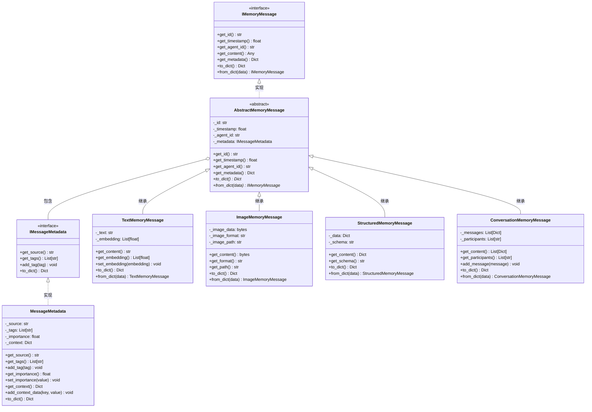

```mermaid
classDiagram
    %% 抽象消息接口
    class IMemoryMessage {
        <<interface>>
        +get_id() str
        +get_timestamp() float
        +get_agent_id() str
        +get_content() Any
        +get_metadata() Dict
        +to_dict() Dict
        +from_dict(data) IMemoryMessage
    }
    
    %% 消息元数据接口
    class IMessageMetadata {
        <<interface>>
        +get_source() str
        +get_tags() List[str]
        +add_tag(tag) void
        +to_dict() Dict
    }
    
    %% 抽象基类
    class AbstractMemoryMessage {
        <<abstract>>
        -_id: str
        -_timestamp: float
        -_agent_id: str
        -_metadata: IMessageMetadata
        +get_id() str
        +get_timestamp() float
        +get_agent_id() str
        +get_metadata() Dict
        +to_dict()* Dict
        +from_dict(data)* IMemoryMessage
    }
    
    class MessageMetadata {
        -_source: str
        -_tags: List[str]
        -_importance: float
        -_context: Dict
        +get_source() str
        +get_tags() List[str]
        +add_tag(tag) void
        +get_importance() float
        +set_importance(value) void
        +get_context() Dict
        +add_context_data(key, value) void
        +to_dict() Dict
    }
    
    %% 具体消息类型
    class TextMemoryMessage {
        -_text: str
        -_embedding: List[float]
        +get_content() str
        +get_embedding() List[float]
        +set_embedding(embedding) void
        +to_dict() Dict
        +from_dict(data) TextMemoryMessage
    }
    
    class ImageMemoryMessage {
        -_image_data: bytes
        -_image_format: str
        -_image_path: str
        +get_content() bytes
        +get_format() str
        +get_path() str
        +to_dict() Dict
        +from_dict(data) ImageMemoryMessage
    }
    
    class StructuredMemoryMessage {
        -_data: Dict
        -_schema: str
        +get_content() Dict
        +get_schema() str
        +to_dict() Dict
        +from_dict(data) StructuredMemoryMessage
    }
    
    class ConversationMemoryMessage {
        -_messages: List[Dict]
        -_participants: List[str]
        +get_content() List[Dict]
        +get_participants() List[str]
        +add_message(message) void
        +to_dict() Dict
        +from_dict(data) ConversationMemoryMessage
    }
    
    %% 关系定义
    IMemoryMessage <|.. AbstractMemoryMessage : 实现
    IMessageMetadata <|.. MessageMetadata : 实现
    AbstractMemoryMessage <|-- TextMemoryMessage : 继承
    AbstractMemoryMessage <|-- ImageMemoryMessage : 继承
    AbstractMemoryMessage <|-- StructuredMemoryMessage : 继承
    AbstractMemoryMessage <|-- ConversationMemoryMessage : 继承
    AbstractMemoryMessage o-- IMessageMetadata : 包含
```