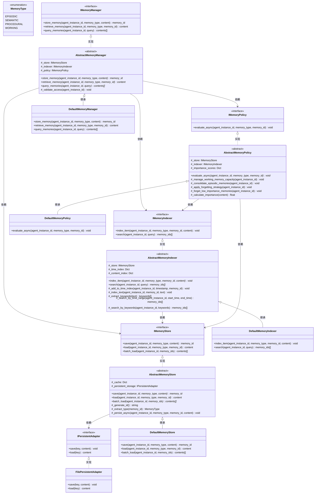

```mermaid
classDiagram
    %% 枚举类型
    class MemoryType {
        <<enumeration>>
        EPISODIC
        SEMANTIC
        PROCEDURAL
        WORKING
    }
    
    %% 抽象接口定义
    class IMemoryManager {
        <<interface>>
        +store_memory(agent_instance_id, memory_type, content) memory_id
        +retrieve_memory(agent_instance_id, memory_type, memory_id) content
        +query_memories(agent_instance_id, query) contents[]
    }
    
    class IMemoryStore {
        <<interface>>
        +save(agent_instance_id, memory_type, content) memory_id
        +load(agent_instance_id, memory_type, memory_id) content
        +batch_load(agent_instance_id, memory_ids) contents[]
    }
    
    class IMemoryIndexer {
        <<interface>>
        +index_item(agent_instance_id, memory_type, memory_id, content) void
        +search(agent_instance_id, query) memory_ids[]
    }
    
    class IMemoryPolicy {
        <<interface>>
        +evaluate_async(agent_instance_id, memory_type, memory_id) void
    }
    
    class IPersistentAdapter {
        <<interface>>
        +save(key, content) void
        +load(key) content
    }
    
    %% 抽象基类实现
    class AbstractMemoryManager {
        <<abstract>>
        #_store: IMemoryStore
        #_indexer: IMemoryIndexer
        #_policy: IMemoryPolicy
        +store_memory(agent_instance_id, memory_type, content)* memory_id
        +retrieve_memory(agent_instance_id, memory_type, memory_id)* content
        +query_memories(agent_instance_id, query)* contents[]
        #_validate_access(agent_instance_id) void
    }
    
    class AbstractMemoryStore {
        <<abstract>>
        #_cache: Dict
        #_persistent_storage: IPersistentAdapter
        +save(agent_instance_id, memory_type, content)* memory_id
        +load(agent_instance_id, memory_type, memory_id)* content
        +batch_load(agent_instance_id, memory_ids)* contents[]
        #_generate_id() string
        #_extract_type(memory_id) MemoryType
        #_persist_async(agent_instance_id, memory_type, memory_id, content) void
    }
    
    class AbstractMemoryIndexer {
        <<abstract>>
        #_store: IMemoryStore
        #_time_index: Dict
        #_content_index: Dict
        +index_item(agent_instance_id, memory_type, memory_id, content)* void
        +search(agent_instance_id, query)* memory_ids[]
        #_add_to_time_index(agent_instance_id, timestamp, memory_id) void
        #_index_text(agent_instance_id, memory_id, text) void
        #_extract_keywords(text) keywords[]
        #_search_by_time_range(agent_instance_id, start_time, end_time) memory_ids[]
        #_search_by_keywords(agent_instance_id, keywords) memory_ids[]
    }
    
    class AbstractMemoryPolicy {
        <<abstract>>
        #_store: IMemoryStore
        #_indexer: IMemoryIndexer
        #_importance_scores: Dict
        +evaluate_async(agent_instance_id, memory_type, memory_id)* void
        #_manage_working_memory_capacity(agent_instance_id) void
        #_consolidate_episodic_memories(agent_instance_id) void
        #_apply_forgetting_strategy(agent_instance_id) void
        #_forget_low_importance_memories(agent_instance_id) void
        #_calculate_importance(content) float
    }
    
    %% 具体实现类
    class DefaultMemoryManager {
        +store_memory(agent_instance_id, memory_type, content) memory_id
        +retrieve_memory(agent_instance_id, memory_type, memory_id) content
        +query_memories(agent_instance_id, query) contents[]
    }
    
    class DefaultMemoryStore {
        +save(agent_instance_id, memory_type, content) memory_id
        +load(agent_instance_id, memory_type, memory_id) content
        +batch_load(agent_instance_id, memory_ids) contents[]
    }
    
    class DefaultMemoryIndexer {
        +index_item(agent_instance_id, memory_type, memory_id, content) void
        +search(agent_instance_id, query) memory_ids[]
    }
    
    class DefaultMemoryPolicy {
        +evaluate_async(agent_instance_id, memory_type, memory_id) void
    }
    
    class FilePersistentAdapter {
        +save(key, content) void
        +load(key) content
    }
    
    %% 关系定义 - 接口实现与继承
    IMemoryManager <|.. AbstractMemoryManager : 实现
    IMemoryStore <|.. AbstractMemoryStore : 实现
    IMemoryIndexer <|.. AbstractMemoryIndexer : 实现
    IMemoryPolicy <|.. AbstractMemoryPolicy : 实现
    IPersistentAdapter <|.. FilePersistentAdapter : 实现
    
    AbstractMemoryManager <|-- DefaultMemoryManager : 继承
    AbstractMemoryStore <|-- DefaultMemoryStore : 继承
    AbstractMemoryIndexer <|-- DefaultMemoryIndexer : 继承
    AbstractMemoryPolicy <|-- DefaultMemoryPolicy : 继承
    
    %% 依赖关系
    AbstractMemoryManager --> IMemoryStore : 依赖
    AbstractMemoryManager --> IMemoryIndexer : 依赖
    AbstractMemoryManager --> IMemoryPolicy : 依赖
    AbstractMemoryIndexer --> IMemoryStore : 依赖
    AbstractMemoryPolicy --> IMemoryStore : 依赖
    AbstractMemoryPolicy --> IMemoryIndexer : 依赖
    AbstractMemoryStore --> IPersistentAdapter : 依赖
```