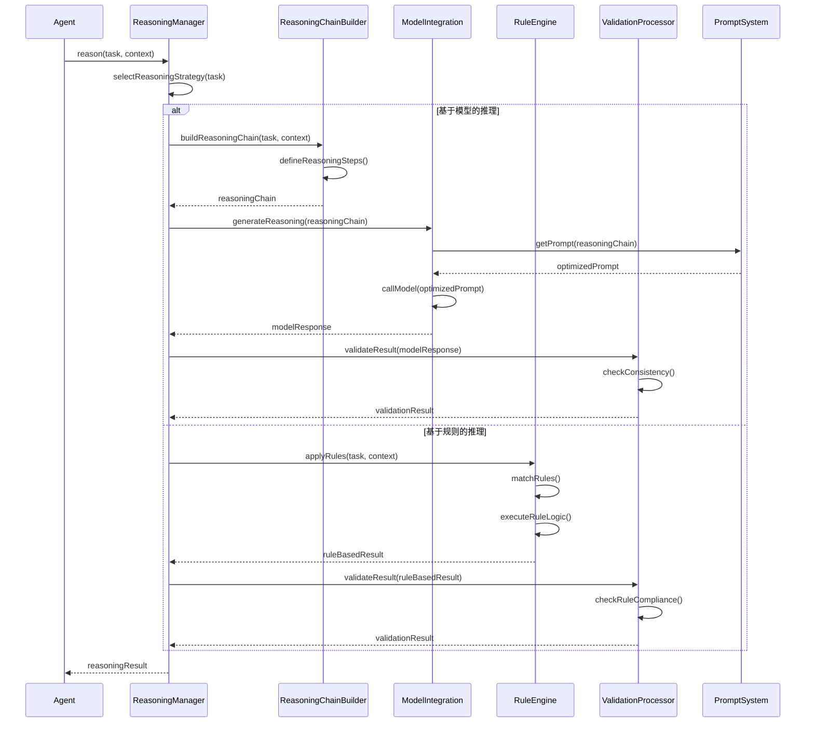

```mermaid
sequenceDiagram
    participant Agent
    participant RM as ReasoningManager
    participant RC as ReasoningChainBuilder
    participant MC as ModelIntegration
    participant RE as RuleEngine
    participant VP as ValidationProcessor
    participant PS as PromptSystem
    
    Agent->>RM: reason(task, context)
    RM->>RM: selectReasoningStrategy(task)
    
    alt 基于模型的推理
        RM->>RC: buildReasoningChain(task, context)
        RC->>RC: defineReasoningSteps()
        RC-->>RM: reasoningChain
        
        RM->>MC: generateReasoning(reasoningChain)
        MC->>PS: getPrompt(reasoningChain)
        PS-->>MC: optimizedPrompt
        MC->>MC: callModel(optimizedPrompt)
        MC-->>RM: modelResponse
        
        RM->>VP: validateResult(modelResponse)
        VP->>VP: checkConsistency()
        VP-->>RM: validationResult
    else 基于规则的推理
        RM->>RE: applyRules(task, context)
        RE->>RE: matchRules()
        RE->>RE: executeRuleLogic()
        RE-->>RM: ruleBasedResult
        
        RM->>VP: validateResult(ruleBasedResult)
        VP->>VP: checkRuleCompliance()
        VP-->>RM: validationResult
    end
    
    RM-->>Agent: reasoningResult
```