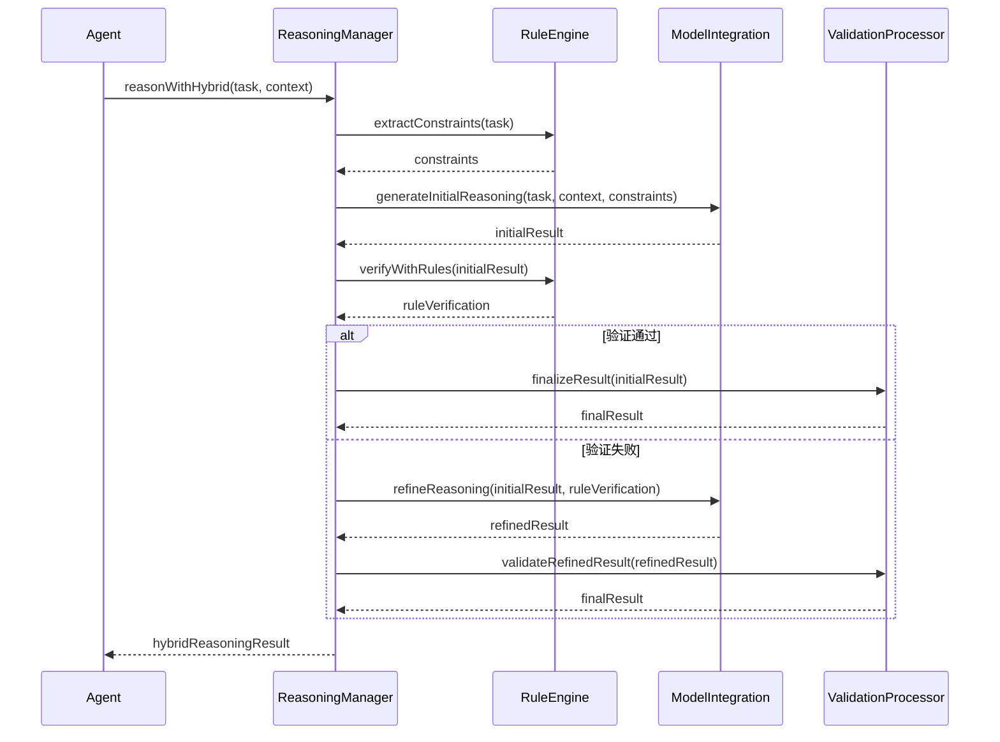

```mermaid
sequenceDiagram
    participant Agent
    participant RM as ReasoningManager
    participant RE as RuleEngine
    participant MC as ModelIntegration
    participant VP as ValidationProcessor
    
    Agent->>RM: reasonWithHybrid(task, context)
    
    RM->>RE: extractConstraints(task)
    RE-->>RM: constraints
    
    RM->>MC: generateInitialReasoning(task, context, constraints)
    MC-->>RM: initialResult
    
    RM->>RE: verifyWithRules(initialResult)
    RE-->>RM: ruleVerification
    
    alt 验证通过
        RM->>VP: finalizeResult(initialResult)
        VP-->>RM: finalResult
    else 验证失败
        RM->>MC: refineReasoning(initialResult, ruleVerification)
        MC-->>RM: refinedResult
        RM->>VP: validateRefinedResult(refinedResult)
        VP-->>RM: finalResult
    end
    
    RM-->>Agent: hybridReasoningResult
```