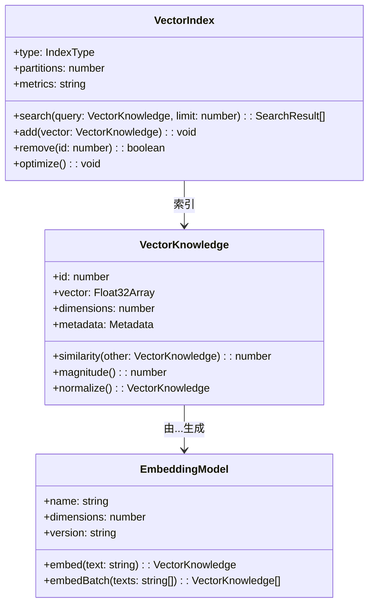

```mermaid
classDiagram
    class VectorKnowledge {
        +id: number
        +vector: Float32Array
        +dimensions: number
        +metadata: Metadata
        +similarity(other: VectorKnowledge): number
        +magnitude(): number
        +normalize(): VectorKnowledge
    }
    
    class EmbeddingModel {
        +name: string
        +dimensions: number
        +version: string
        +embed(text: string): VectorKnowledge
        +embedBatch(texts: string[]): VectorKnowledge[]
    }
    
    class VectorIndex {
        +type: IndexType
        +partitions: number
        +metrics: string
        +search(query: VectorKnowledge, limit: number): SearchResult[]
        +add(vector: VectorKnowledge): void
        +remove(id: number): boolean
        +optimize(): void
    }
    
    VectorKnowledge --> EmbeddingModel : 由...生成
    VectorIndex --> VectorKnowledge : 索引
```