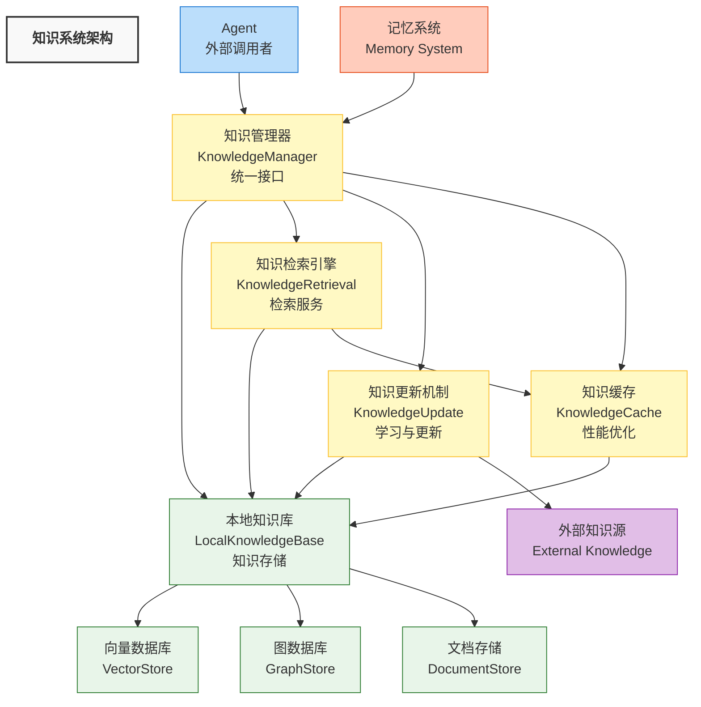

```mermaid
graph TB
    %% 总标题
    title[<b>知识系统架构</b>]
    
    %% 外部接口
    Agent["Agent<br>外部调用者"]
    Memory["记忆系统<br>Memory System"]
    
    %% 核心模块
    KM["知识管理器<br>KnowledgeManager<br>统一接口"]
    LKB["本地知识库<br>LocalKnowledgeBase<br>知识存储"]
    KR["知识检索引擎<br>KnowledgeRetrieval<br>检索服务"]
    KU["知识更新机制<br>KnowledgeUpdate<br>学习与更新"]
    KC["知识缓存<br>KnowledgeCache<br>性能优化"]
    
    %% 存储层
    Vector["向量数据库<br>VectorStore"]
    Graph["图数据库<br>GraphStore"]
    Doc["文档存储<br>DocumentStore"]
    
    %% 外部知识源
    ExtKB["外部知识源<br>External Knowledge"]
    
    %% 关系定义
    Agent --> KM
    Memory --> KM
    KM --> LKB
    KM --> KR
    KM --> KU
    KM --> KC
    KR --> LKB
    KR --> KC
    KU --> LKB
    KC --> LKB
    LKB --> Vector
    LKB --> Graph
    LKB --> Doc
    KU --> ExtKB
    
    %% 样式设置
    classDef titleClass fill:#f9f9f9,stroke:#333,stroke-width:2px,font-weight:bold
    classDef agentClass fill:#bbdefb,stroke:#1976d2,stroke-width:1px
    classDef memoryClass fill:#ffccbc,stroke:#e64a19,stroke-width:1px
    classDef moduleClass fill:#fff9c4,stroke:#fbc02d,stroke-width:1px
    classDef storeClass fill:#e8f5e9,stroke:#2e7d32,stroke-width:1px
    classDef extClass fill:#e1bee7,stroke:#8e24aa,stroke-width:1px
    
    class title titleClass
    class Agent agentClass
    class Memory memoryClass
    class KM,KR,KU,KC moduleClass
    class LKB,Vector,Graph,Doc storeClass
    class ExtKB extClass
```