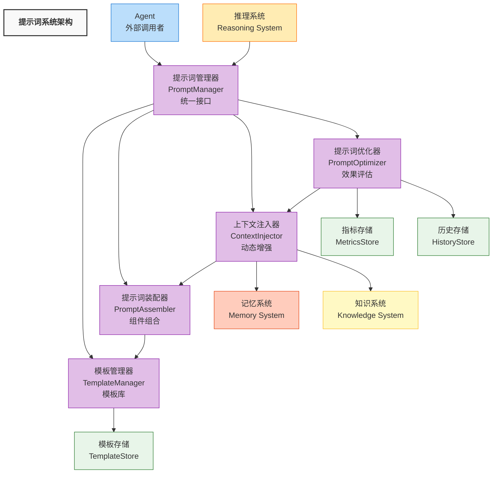

```mermaid
graph TB
    %% 总标题
    title[<b>提示词系统架构</b>]
    
    %% 外部接口
    Agent["Agent<br>外部调用者"]
    Knowledge["知识系统<br>Knowledge System"]
    Memory["记忆系统<br>Memory System"]
    Reasoning["推理系统<br>Reasoning System"]
    
    %% 核心模块
    PM["提示词管理器<br>PromptManager<br>统一接口"]
    TM["模板管理器<br>TemplateManager<br>模板库"]
    PA["提示词装配器<br>PromptAssembler<br>组件组合"]
    CI["上下文注入器<br>ContextInjector<br>动态增强"]
    PO["提示词优化器<br>PromptOptimizer<br>效果评估"]
    
    %% 存储层
    TemplateStore["模板存储<br>TemplateStore"]
    HistoryStore["历史存储<br>HistoryStore"]
    MetricsStore["指标存储<br>MetricsStore"]
    
    %% 关系定义
    Agent --> PM
    PM --> TM
    PM --> PA
    PM --> CI
    PM --> PO
    TM --> TemplateStore
    PA --> TM
    CI --> PA
    CI --> Memory
    CI --> Knowledge
    PO --> CI
    PO --> MetricsStore
    PO --> HistoryStore
    Reasoning --> PM
    
    %% 样式设置
    classDef titleClass fill:#f9f9f9,stroke:#333,stroke-width:2px,font-weight:bold
    classDef agentClass fill:#bbdefb,stroke:#1976d2,stroke-width:1px
    classDef knowledgeClass fill:#fff9c4,stroke:#fbc02d,stroke-width:1px
    classDef memoryClass fill:#ffccbc,stroke:#e64a19,stroke-width:1px
    classDef reasoningClass fill:#ffecb3,stroke:#ff6f00,stroke-width:1px
    classDef moduleClass fill:#e1bee7,stroke:#8e24aa,stroke-width:1px
    classDef storeClass fill:#e8f5e9,stroke:#2e7d32,stroke-width:1px
    
    class title titleClass
    class Agent agentClass
    class Knowledge knowledgeClass
    class Memory memoryClass
    class Reasoning reasoningClass
    class PM,TM,PA,CI,PO moduleClass
    class TemplateStore,HistoryStore,MetricsStore storeClass
```