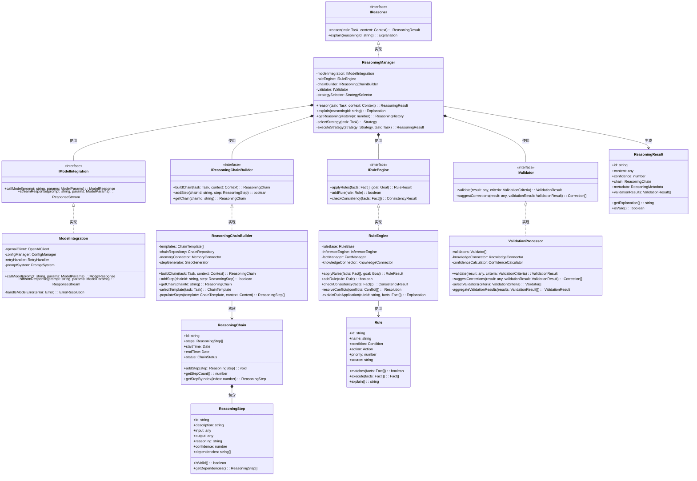

```mermaid
classDiagram
    %% 接口定义
    class IReasoner {
        <<interface>>
        +reason(task: Task, context: Context): ReasoningResult
        +explain(reasoningId: string): Explanation
    }
    
    class IModelIntegration {
        <<interface>>
        +callModel(prompt: string, params: ModelParams): ModelResponse
        +streamResponse(prompt: string, params: ModelParams): ResponseStream
    }
    
    class IRuleEngine {
        <<interface>>
        +applyRules(facts: Fact[], goal: Goal): RuleResult
        +addRule(rule: Rule): boolean
        +checkConsistency(facts: Fact[]): ConsistencyResult
    }
    
    class IReasoningChainBuilder {
        <<interface>>
        +buildChain(task: Task, context: Context): ReasoningChain
        +addStep(chainId: string, step: ReasoningStep): boolean
        +getChain(chainId: string): ReasoningChain
    }
    
    class IValidator {
        <<interface>>
        +validate(result: any, criteria: ValidationCriteria): ValidationResult
        +suggestCorrections(result: any, validationResult: ValidationResult): Correction[]
    }
    
    %% 实现类
    class ReasoningManager {
        -modelIntegration: IModelIntegration
        -ruleEngine: IRuleEngine
        -chainBuilder: IReasoningChainBuilder
        -validator: IValidator
        -strategySelector: StrategySelector
        +reason(task: Task, context: Context): ReasoningResult
        +explain(reasoningId: string): Explanation
        +getReasoningHistory(n: number): ReasoningHistory
        -selectStrategy(task: Task): Strategy
        -executeStrategy(strategy: Strategy, task: Task): ReasoningResult
    }
    
    class ModelIntegration {
        -openaiClient: OpenAIClient
        -configManager: ConfigManager
        -retryHandler: RetryHandler
        -promptSystem: PromptSystem
        +callModel(prompt: string, params: ModelParams): ModelResponse
        +streamResponse(prompt: string, params: ModelParams): ResponseStream
        -handleModelError(error: Error): ErrorResolution
    }
    
    class RuleEngine {
        -ruleBase: RuleBase
        -inferenceEngine: InferenceEngine
        -factManager: FactManager
        -knowledgeConnector: KnowledgeConnector
        +applyRules(facts: Fact[], goal: Goal): RuleResult
        +addRule(rule: Rule): boolean
        +checkConsistency(facts: Fact[]): ConsistencyResult
        -resolveConflicts(conflicts: Conflict[]): Resolution
        -explainRuleApplication(ruleId: string, facts: Fact[]): Explanation
    }
    
    class ReasoningChainBuilder {
        -templates: ChainTemplate[]
        -chainRepository: ChainRepository
        -memoryConnector: MemoryConnector
        -stepGenerator: StepGenerator
        +buildChain(task: Task, context: Context): ReasoningChain
        +addStep(chainId: string, step: ReasoningStep): boolean
        +getChain(chainId: string): ReasoningChain
        -selectTemplate(task: Task): ChainTemplate
        -populateSteps(template: ChainTemplate, context: Context): ReasoningStep[]
    }
    
    class ValidationProcessor {
        -validators: Validator[]
        -knowledgeConnector: KnowledgeConnector
        -confidenceCalculator: ConfidenceCalculator
        +validate(result: any, criteria: ValidationCriteria): ValidationResult
        +suggestCorrections(result: any, validationResult: ValidationResult): Correction[]
        -selectValidators(criteria: ValidationCriteria): Validator[]
        -aggregateValidationResults(results: ValidationResult[]): ValidationResult
    }
    
    %% 数据类
    class ReasoningResult {
        +id: string
        +content: any
        +confidence: number
        +chain: ReasoningChain
        +metadata: ReasoningMetadata
        +validationResults: ValidationResult[]
        +getExplanation(): string
        +isValid(): boolean
    }
    
    class ReasoningChain {
        +id: string
        +steps: ReasoningStep[]
        +startTime: Date
        +endTime: Date
        +status: ChainStatus
        +addStep(step: ReasoningStep): void
        +getStepCount(): number
        +getStepByIndex(index: number): ReasoningStep
    }
    
    class ReasoningStep {
        +id: string
        +description: string
        +input: any
        +output: any
        +reasoning: string
        +confidence: number
        +dependencies: string[]
        +isValid(): boolean
        +getDependencies(): ReasoningStep[]
    }
    
    class Rule {
        +id: string
        +name: string
        +condition: Condition
        +action: Action
        +priority: number
        +source: string
        +matches(facts: Fact[]): boolean
        +execute(facts: Fact[]): Fact[]
        +explain(): string
    }
    
    %% 关系定义
    IReasoner <|.. ReasoningManager : 实现
    IModelIntegration <|.. ModelIntegration : 实现
    IRuleEngine <|.. RuleEngine : 实现
    IReasoningChainBuilder <|.. ReasoningChainBuilder : 实现
    IValidator <|.. ValidationProcessor : 实现
    
    ReasoningManager *-- IModelIntegration : 使用
    ReasoningManager *-- IRuleEngine : 使用
    ReasoningManager *-- IReasoningChainBuilder : 使用
    ReasoningManager *-- IValidator : 使用
    
    ReasoningManager --> ReasoningResult : 生成
    ReasoningChainBuilder --> ReasoningChain : 构建
    ReasoningChain *-- ReasoningStep : 包含
    RuleEngine --> Rule : 使用
```