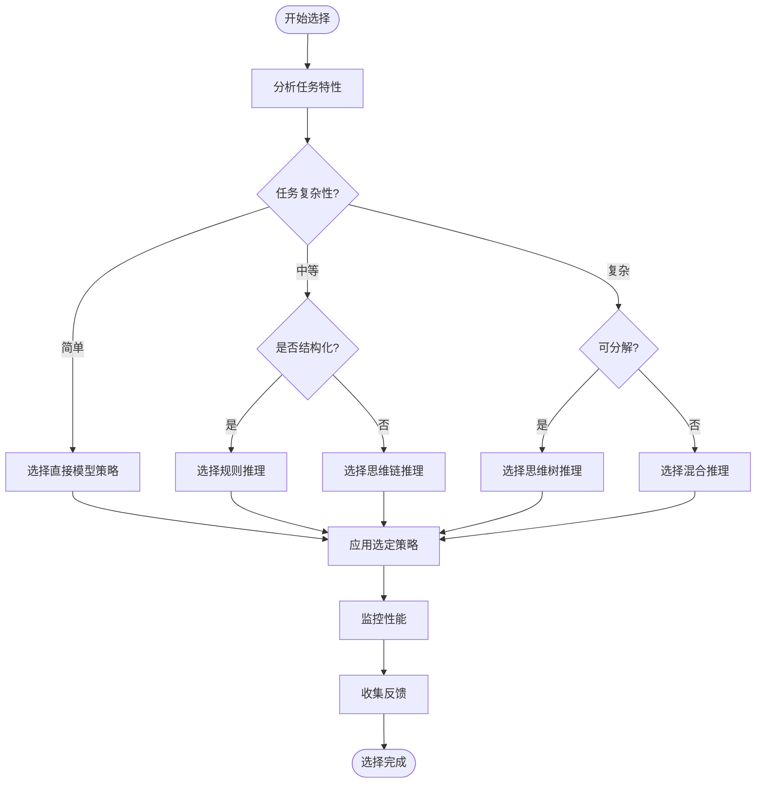

```mermaid
flowchart TD
    Start([开始选择]) --> AnalyzeTask["分析任务特性"]
    AnalyzeTask --> CheckComplexity{"任务复杂性?"}
    
    CheckComplexity -->|"简单"| DirectModel["选择直接模型策略"]
    CheckComplexity -->|"中等"| CheckStructured{"是否结构化?"}
    CheckComplexity -->|"复杂"| CheckDecomposable{"可分解?"}
    
    CheckStructured -->|"是"| RuleBased["选择规则推理"]
    CheckStructured -->|"否"| CoT["选择思维链推理"]
    
    CheckDecomposable -->|"是"| ToT["选择思维树推理"]
    CheckDecomposable -->|"否"| Hybrid["选择混合推理"]
    
    DirectModel --> ApplyStrategy["应用选定策略"]
    RuleBased --> ApplyStrategy
    CoT --> ApplyStrategy
    ToT --> ApplyStrategy
    Hybrid --> ApplyStrategy
    
    ApplyStrategy --> MonitorPerformance["监控性能"]
    MonitorPerformance --> FeedbackLoop["收集反馈"]
    FeedbackLoop --> End([选择完成])
```