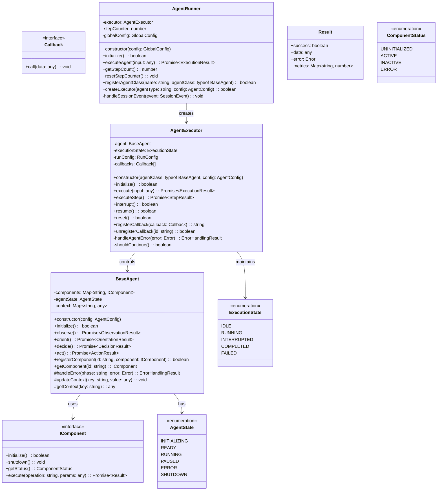

```mermaid
classDiagram
    %% 接口定义
    class IComponent {
        <<interface>>
        +initialize(): boolean
        +shutdown(): void
        +getStatus(): ComponentStatus
        +execute(operation: string, params: any): Promise~Result~
    }
    
    %% 回调接口
    class Callback {
        <<interface>>
        +call(data: any): void
    }
    
    %% 核心类
    class BaseAgent {
        -components: Map~string, IComponent~
        -agentState: AgentState
        -context: Map~string, any~
        +constructor(config: AgentConfig)
        +initialize(): boolean
        +observe(): Promise~ObservationResult~
        +orient(): Promise~OrientationResult~
        +decide(): Promise~DecisionResult~
        +act(): Promise~ActionResult~
        +registerComponent(id: string, component: IComponent): boolean
        +getComponent(id: string): IComponent
        #handleError(phase: string, error: Error): ErrorHandlingResult
        #updateContext(key: string, value: any): void
        #getContext(key: string): any
    }
    
    class AgentExecutor {
        -agent: BaseAgent
        -executionState: ExecutionState
        -runConfig: RunConfig
        -callbacks: Callback[]
        +constructor(agentClass: typeof BaseAgent, config: AgentConfig)
        +initialize(): boolean
        +execute(input: any): Promise~ExecutionResult~
        +executeStep(): Promise~StepResult~
        +interrupt(): boolean
        +resume(): boolean
        +reset(): boolean
        +registerCallback(callback: Callback): string
        +unregisterCallback(id: string): boolean
        -handleAgentError(error: Error): ErrorHandlingResult
        -shouldContinue(): boolean
    }
    
    class AgentRunner {
        -executor: AgentExecutor
        -stepCounter: number
        -globalConfig: GlobalConfig
        +constructor(config: GlobalConfig)
        +initialize(): boolean
        +executeAgent(input: any): Promise~ExecutionResult~
        +getStepCount(): number
        +resetStepCounter(): void
        +registerAgentClass(name: string, agentClass: typeof BaseAgent): boolean
        +createExecutor(agentType: string, config: AgentConfig): boolean
        -handleSessionEvent(event: SessionEvent): void
    }
    
    %% 结果类
    class Result {
        +success: boolean
        +data: any
        +error: Error
        +metrics: Map~string, number~
    }
    
    %% 枚举和类型
    class AgentState {
        <<enumeration>>
        INITIALIZING
        READY
        RUNNING
        PAUSED
        ERROR
        SHUTDOWN
    }
    
    class ComponentStatus {
        <<enumeration>>
        UNINITIALIZED
        ACTIVE
        INACTIVE
        ERROR
    }
    
    class ExecutionState {
        <<enumeration>>
        IDLE
        RUNNING
        INTERRUPTED
        COMPLETED
        FAILED
    }
    
    %% 关系定义
    AgentRunner --> AgentExecutor : creates
    AgentExecutor --> BaseAgent : controls
    BaseAgent --> IComponent : uses
    BaseAgent --> AgentState : has
    AgentExecutor --> ExecutionState : maintains
```