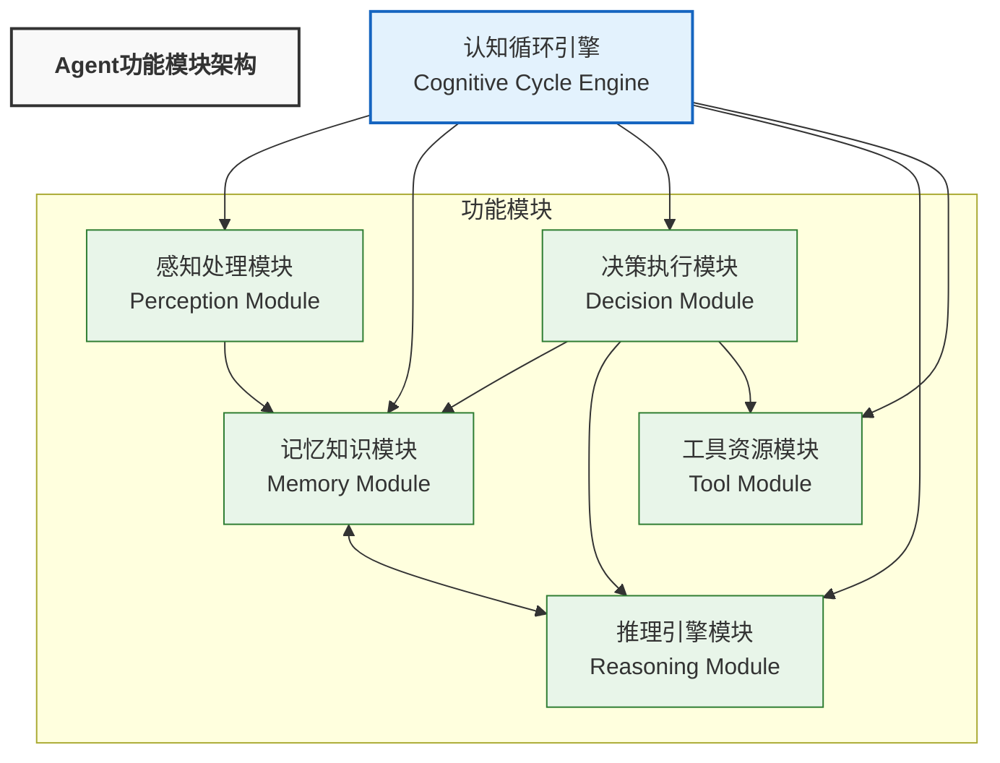

```mermaid
graph TB
    %% 总标题
    title[<b>Agent功能模块架构</b>]
    
    %% 核心引擎
    CycleEngine["认知循环引擎<br>Cognitive Cycle Engine"]
    
    %% 功能模块
    subgraph FunctionalModules["功能模块"]
        Perception["感知处理模块<br>Perception Module"]
        Memory["记忆知识模块<br>Memory Module"]
        Decision["决策执行模块<br>Decision Module"]
        Reasoning["推理引擎模块<br>Reasoning Module"]
        Tool["工具资源模块<br>Tool Module"]
    end
    
    %% 交互关系
    CycleEngine --> Perception
    CycleEngine --> Memory
    CycleEngine --> Decision
    CycleEngine --> Reasoning
    CycleEngine --> Tool
    
    Perception --> Memory
    Memory <--> Reasoning
    Decision --> Memory
    Decision --> Reasoning
    Decision --> Tool
    
    %% 样式设置
    classDef titleClass fill:#f9f9f9,stroke:#333,stroke-width:2px,font-weight:bold
    classDef engineClass fill:#e3f2fd,stroke:#1565c0,stroke-width:2px
    classDef moduleClass fill:#e8f5e9,stroke:#2e7d32,stroke-width:1px
    
    class title titleClass
    class CycleEngine engineClass
    class Perception,Memory,Decision,Reasoning,Tool moduleClass
```