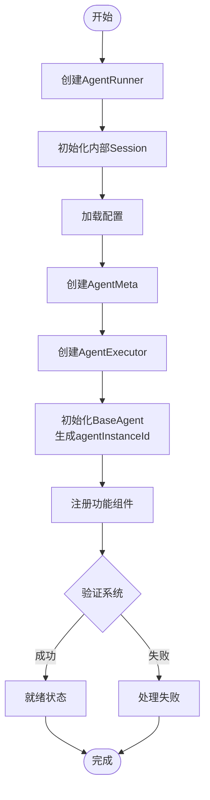

```mermaid
flowchart TD
    Start([开始]) --> CreateRunner["创建AgentRunner"]
    CreateRunner --> InitSession["初始化内部Session"]
    InitSession --> LoadConfig["加载配置"]
    LoadConfig --> CreateAgentMeta["创建AgentMeta"]
    CreateAgentMeta --> CreateExecutor["创建AgentExecutor"]
    CreateExecutor --> InitAgent["初始化BaseAgent<br>生成agentInstanceId"]
    InitAgent --> RegisterComponents["注册功能组件"]
    RegisterComponents --> ValidateSystem{"验证系统"}
    ValidateSystem -->|成功| StartEngine["就绪状态"]
    ValidateSystem -->|失败| HandleFailure["处理失败"]
    StartEngine --> End([完成])
    HandleFailure --> End
```