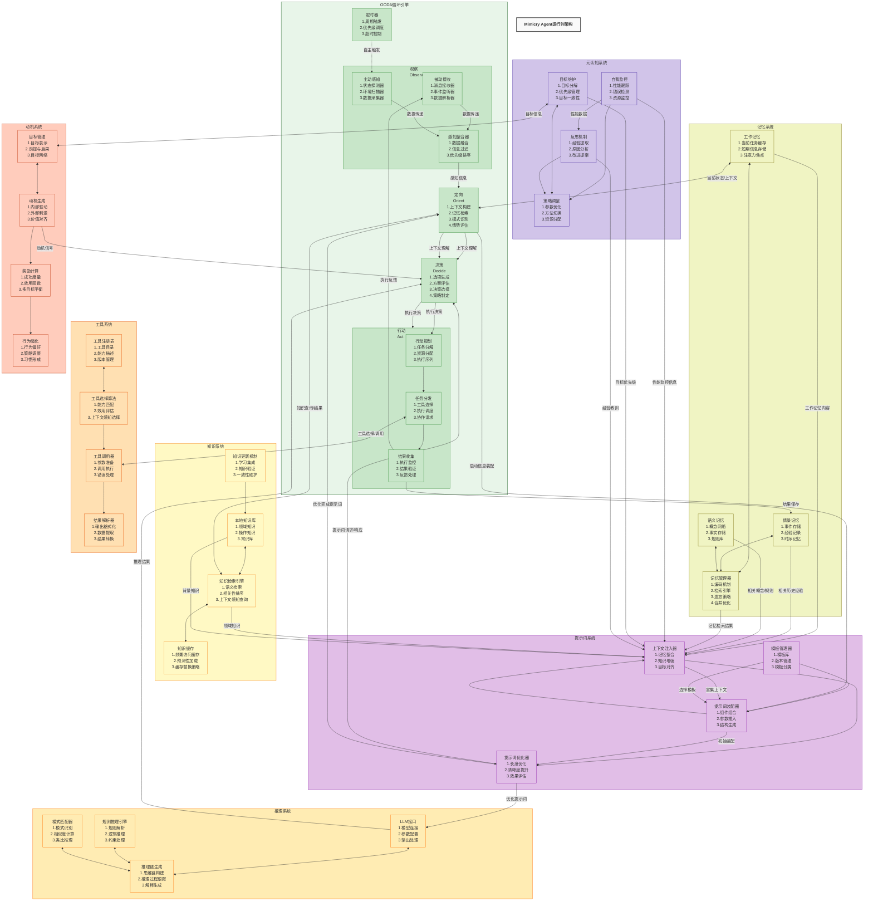

```mermaid
graph TB
    %% 总标题
    title[<b>Mimicry Agent运行时架构</b>]
    
    %% OODA循环引擎
    subgraph OODALoop["OODA循环引擎"]
        direction LR
        
        %% 观察细分
        subgraph Observe["观察<br>Observe"]
            direction TB
            PassiveReceive["被动接收<br>1.消息接收器<br>2.事件监听器<br>3.数据解析器"] 
            ActiveSense["主动感知<br>1.状态探测器<br>2.环境扫描器<br>3.数据采集器"]
            ObserveIntegrator["感知整合器<br>1.数据融合<br>2.信息过滤<br>3.优先级排序"]
        end
        
        %% 定向细分
        Orient["定向<br>Orient<br>1.上下文构建<br>2.记忆检索<br>3.模式识别<br>4.情势评估"]
        
        %% 决策细分
        Decide["决策<br>Decide<br>1.选项生成<br>2.方案评估<br>3.决策选择<br>4.策略制定"]
        
        %% 行动细分
        subgraph Act["行动<br>Act"]
            direction TB
            ActionPlanner["行动规划<br>1.任务分解<br>2.资源分配<br>3.执行序列"]
            TaskDispatcher["任务分发<br>1.工具选择<br>2.执行调度<br>3.协作请求"]
            ResultCollector["结果收集<br>1.执行监控<br>2.结果验证<br>3.反馈处理"]
        end
        
        %% 循环流程
        Timer["定时器<br>1.周期触发<br>2.优先级调度<br>3.超时控制"] -.->|自主触发| ActiveSense
        PassiveReceive -->|数据传递| ObserveIntegrator
        ActiveSense -->|数据传递| ObserveIntegrator
        ObserveIntegrator -->|感知信息| Orient
        Orient -->|上下文理解| Decide
        Decide -->|执行决策| ActionPlanner
        ActionPlanner --> TaskDispatcher --> ResultCollector
        ResultCollector -->|执行反馈| PassiveReceive
    end
    
    %% 记忆系统
    subgraph Memory["记忆系统"]
        direction LR
        
        %% 工作记忆
        WorkingMemory["工作记忆<br>1.当前任务缓存<br>2.短期信息存储<br>3.注意力焦点"]
        
        %% 情景记忆
        EpisodicMemory["情景记忆<br>1.事件存储<br>2.经验记录<br>3.时序记忆"]
        
        %% 语义记忆
        SemanticMemory["语义记忆<br>1.概念网络<br>2.事实存储<br>3.规则库"]
        
        %% 记忆管理器
        MemoryManager["记忆管理器<br>1.编码机制<br>2.检索引擎<br>3.遗忘策略<br>4.合并优化"]
        
        %% 记忆系统连接
        WorkingMemory <--> MemoryManager
        EpisodicMemory <--> MemoryManager
        SemanticMemory <--> MemoryManager
    end
    
    %% 知识系统
    subgraph Knowledge["知识系统"]
        direction TB
        
        %% 本地知识库
        LocalKB["本地知识库<br>1.领域知识<br>2.操作知识<br>3.常识库"]
        
        %% 知识检索引擎
        KnowledgeRetrieval["知识检索引擎<br>1.语义检索<br>2.相关性排序<br>3.上下文感知查询"]
        
        %% 知识更新机制
        KnowledgeUpdate["知识更新机制<br>1.学习集成<br>2.知识验证<br>3.一致性维护"]
        
        %% 知识缓存
        KnowledgeCache["知识缓存<br>1.频繁访问缓存<br>2.预测性加载<br>3.缓存替换策略"]
        
        %% 知识系统连接
        LocalKB <--> KnowledgeRetrieval
        KnowledgeRetrieval <--> KnowledgeCache
        KnowledgeUpdate --> LocalKB
    end
    
    %% 提示词系统
    subgraph Prompt["提示词系统"]
        direction TB
        
        %% 模板管理器
        TemplateManager["模板管理器<br>1.模板库<br>2.版本管理<br>3.模板分类"]
        
        %% 提示词装配器
        PromptAssembler["提示词装配器<br>1.组件组合<br>2.参数插入<br>3.结构生成"]
        
        %% 上下文注入器
        ContextInjector["上下文注入器<br>1.记忆整合<br>2.知识增强<br>3.目标对齐"]
        
        %% 提示词优化器
        PromptOptimizer["提示词优化器<br>1.长度优化<br>2.清晰度提升<br>3.效果评估"]
        
        %% 提示词系统连接
        TemplateManager --> PromptAssembler
        PromptAssembler --> ContextInjector
        ContextInjector --> PromptOptimizer
    end
    
    %% 推理系统
    subgraph Reasoning["推理系统"]
        direction TB
        
        %% LLM接口
        LLMInterface["LLM接口<br>1.模型连接<br>2.参数配置<br>3.输出处理"]
        
        %% 规则推理引擎
        RuleEngine["规则推理引擎<br>1.规则解析<br>2.逻辑推理<br>3.约束处理"]
        
        %% 模式匹配器
        PatternMatcher["模式匹配器<br>1.模式识别<br>2.相似度计算<br>3.类比推理"]
        
        %% 推理链生成
        ReasoningChain["推理链生成<br>1.思维链构建<br>2.推理过程跟踪<br>3.解释生成"]
        
        %% 推理系统连接
        LLMInterface <--> ReasoningChain
        RuleEngine <--> ReasoningChain
        PatternMatcher <--> ReasoningChain
    end
    
    %% 工具系统
    subgraph Tools["工具系统"]
        direction TB
        
        %% 工具注册表
        ToolRegistry["工具注册表<br>1.工具目录<br>2.能力描述<br>3.版本管理"]
        
        %% 工具调用器
        ToolCaller["工具调用器<br>1.参数准备<br>2.调用执行<br>3.错误处理"]
        
        %% 结果解析器
        ResultParser["结果解析器<br>1.输出格式化<br>2.数据提取<br>3.结果转换"]
        
        %% 工具选择算法
        ToolSelector["工具选择算法<br>1.能力匹配<br>2.效用评估<br>3.上下文感知选择"]
        
        %% 工具系统连接
        ToolRegistry <--> ToolSelector
        ToolSelector --> ToolCaller
        ToolCaller --> ResultParser
    end
    
    %% 元认知系统
    subgraph MetaCognition["元认知系统"]
        direction TB
        
        %% 自我监控
        SelfMonitor["自我监控<br>1.性能跟踪<br>2.错误检测<br>3.资源监控"]
        
        %% 策略调整
        StrategyAdjuster["策略调整<br>1.参数优化<br>2.方法切换<br>3.资源分配"]
        
        %% 目标维护
        GoalMaintainer["目标维护<br>1.目标分解<br>2.优先级管理<br>3.目标一致性"]
        
        %% 反思机制
        ReflectionMechanism["反思机制<br>1.经验提取<br>2.原因分析<br>3.改进提案"]
        
        %% 元认知系统连接
        SelfMonitor --> StrategyAdjuster
        GoalMaintainer <--> StrategyAdjuster
        ReflectionMechanism --> StrategyAdjuster
    end
    
    %% 动机系统
    subgraph Motivation["动机系统"]
        direction TB
        
        %% 目标管理
        GoalManager["目标管理<br>1.目标表示<br>2.前提与后果<br>3.目标网络"]
        
        %% 动机生成
        MotiveGenerator["动机生成<br>1.内部驱动<br>2.外部刺激<br>3.价值对齐"]
        
        %% 奖励计算
        RewardCalculator["奖励计算<br>1.成功度量<br>2.效用函数<br>3.多目标平衡"]
        
        %% 行为强化
        BehaviorReinforcer["行为强化<br>1.行为偏好<br>2.策略调整<br>3.习惯形成"]
        
        %% 动机系统连接
        GoalManager <--> MotiveGenerator
        MotiveGenerator --> RewardCalculator
        RewardCalculator --> BehaviorReinforcer
    end
    
    %% 系统间主要数据流
    %% 定向阶段的信息装配流程
    WorkingMemory <-->|"当前状态/上下文"| Orient
    Orient -->|"启动信息装配"| PromptAssembler
    
    %% 记忆系统到提示词系统的信息流
    WorkingMemory -->|"工作记忆内容"| ContextInjector
    EpisodicMemory -->|"相关历史经验"| ContextInjector
    SemanticMemory -->|"相关概念/规则"| ContextInjector
    MemoryManager -->|"记忆检索结果"| ContextInjector
    
    %% 知识系统到提示词系统的信息流
    KnowledgeRetrieval -->|"领域知识"| ContextInjector
    LocalKB -->|"背景知识"| ContextInjector
    
    %% 元认知系统到提示词系统的信息流
    SelfMonitor -->|"性能监控信息"| ContextInjector
    GoalMaintainer -->|"目标优先级"| ContextInjector
    ReflectionMechanism -->|"经验教训"| ContextInjector
    
    %% 提示词系统内部处理流程
    ContextInjector -->|"富集上下文"| PromptAssembler
    TemplateManager -->|"选择模板"| PromptAssembler
    PromptAssembler -->|"初始装配"| PromptOptimizer
    PromptOptimizer -->|"优化完成提示词"| Orient
    
    %% 其他核心数据流
    Orient <-->|"知识查询/结果"| KnowledgeRetrieval
    Orient -->|"上下文理解"| Decide
    Decide <-->|"提示词请求/响应"| PromptOptimizer
    PromptOptimizer -->|"优化提示词"| LLMInterface
    LLMInterface -->|"推理结果"| Decide
    Decide -->|"执行决策"| Act
    TaskDispatcher <-->|"工具选择/调用"| ToolCaller
    ResultCollector -->|"结果保存"| EpisodicMemory
    SelfMonitor -->|"性能数据"| ReflectionMechanism
    GoalMaintainer <-->|"目标信息"| GoalManager
    MotiveGenerator -->|"动机信号"| Decide
    
    %% 样式设置
    classDef titleClass fill:#f9f9f9,stroke:#333,stroke-width:2px,font-weight:bold
    classDef OODALoopClass fill:#e8f5e9,stroke:#1b5e20,stroke-width:1px
    classDef ObserveClass fill:#c8e6c9,stroke:#388e3c,stroke-width:1px
    classDef ActClass fill:#c8e6c9,stroke:#388e3c,stroke-width:1px
    classDef MemoryClass fill:#f0f4c3,stroke:#827717,stroke-width:1px
    classDef KnowledgeClass fill:#fff9c4,stroke:#f57f17,stroke-width:1px
    classDef PromptClass fill:#e1bee7,stroke:#8e24aa,stroke-width:1px
    classDef ReasoningClass fill:#ffecb3,stroke:#ff6f00,stroke-width:1px
    classDef ToolsClass fill:#ffe0b2,stroke:#e65100,stroke-width:1px
    classDef MetaClass fill:#d1c4e9,stroke:#4527a0,stroke-width:1px
    classDef MotivationClass fill:#ffccbc,stroke:#bf360c,stroke-width:1px
    
    class title titleClass
    class OODALoop OODALoopClass
    class Observe,Orient,Decide,Act,Timer ObserveClass
    class PassiveReceive,ActiveSense,ObserveIntegrator ObserveClass
    class ActionPlanner,TaskDispatcher,ResultCollector ActClass
    class Memory,WorkingMemory,EpisodicMemory,SemanticMemory,MemoryManager MemoryClass
    class Knowledge,LocalKB,KnowledgeRetrieval,KnowledgeUpdate,KnowledgeCache KnowledgeClass
    class Prompt,TemplateManager,PromptAssembler,ContextInjector,PromptOptimizer PromptClass
    class Reasoning,LLMInterface,RuleEngine,PatternMatcher,ReasoningChain ReasoningClass
    class Tools,ToolRegistry,ToolCaller,ResultParser,ToolSelector ToolsClass
    class MetaCognition,SelfMonitor,StrategyAdjuster,GoalMaintainer,ReflectionMechanism MetaClass
    class Motivation,GoalManager,MotiveGenerator,RewardCalculator,BehaviorReinforcer MotivationClass
```