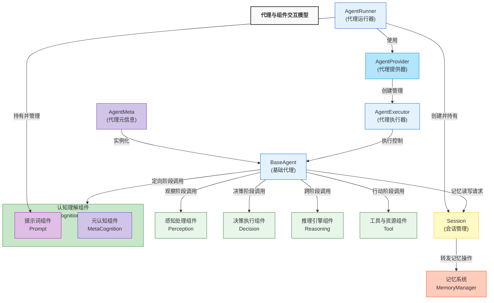

```mermaid
flowchart TB
    %% 总标题
    title[<b>代理与组件交互模型</b>]
    
    %% 核心类
    AgentMeta["AgentMeta<br>(代理元信息)"]
    AgentRunner["AgentRunner<br>(代理运行器)"]
    Session["Session<br>(会话管理)"]
    AgentExecutor["AgentExecutor<br>(代理执行器)"]
    BaseAgent["BaseAgent<br>(基础代理)"]
    AgentProvider["AgentProvider<br>(代理提供器)"]
    
    %% 功能组件
    Perception["感知处理组件<br>Perception"]
    
    %% 认知理解相关组件
    subgraph Cognition["认知理解组件<br>Cognition"]
        direction TB
        Prompt["提示词组件<br>Prompt"]
        MetaCognition["元认知组件<br>MetaCognition"]
    end
    
    Decision["决策执行组件<br>Decision"]
    Memory["记忆系统<br>MemoryManager"]
    Reasoning["推理引擎组件<br>Reasoning"]
    Tool["工具与资源组件<br>Tool"]
    
    %% 交互关系 - 使用更清晰的箭头和标签
    AgentMeta -->|"实例化"| BaseAgent
    AgentRunner -->|"创建并持有"| Session
    AgentRunner -->|"使用"| AgentProvider
    AgentProvider -->|"创建管理"| AgentExecutor
    AgentExecutor -->|"执行控制"| BaseAgent
    
    %% 新增提示词系统交互
    AgentRunner -->|"持有并管理"| Prompt
    
    %% OODA循环调用
    BaseAgent -->|"观察阶段调用"| Perception
    BaseAgent -->|"定向阶段调用"| Cognition
    BaseAgent -->|"决策阶段调用"| Decision
    BaseAgent -->|"行动阶段调用"| Tool
    
    %% 记忆系统交互
    Session -->|"转发记忆操作"| Memory
    BaseAgent -->|"记忆读写请求"| Session
    
    %% 推理系统交互
    BaseAgent -->|"跨阶段调用"| Reasoning
    
    %% 样式设置
    classDef titleClass fill:#f9f9f9,stroke:#333,stroke-width:2px,font-weight:bold
    classDef agentClass fill:#e3f2fd,stroke:#1565c0,stroke-width:1px
    classDef componentClass fill:#e8f5e9,stroke:#2e7d32,stroke-width:1px
    classDef sessionClass fill:#fff9c4,stroke:#fbc02d,stroke-width:1px
    classDef metaClass fill:#d1c4e9,stroke:#673ab7,stroke-width:1px
    classDef memoryClass fill:#ffccbc,stroke:#e64a19,stroke-width:1px
    classDef promptClass fill:#e1bee7,stroke:#8e24aa,stroke-width:1px
    classDef cognitionClass fill:#c8e6c9,stroke:#388e3c,stroke-width:1px
    classDef providerClass fill:#b3e5fc,stroke:#0288d1,stroke-width:1px
    
    class title titleClass
    class AgentRunner,AgentExecutor,BaseAgent agentClass
    class Session sessionClass
    class AgentMeta,MetaCognition metaClass
    class Perception,Decision,Reasoning,Tool componentClass
    class Memory memoryClass
    class Prompt promptClass
    class Cognition cognitionClass
    class AgentProvider providerClass
```