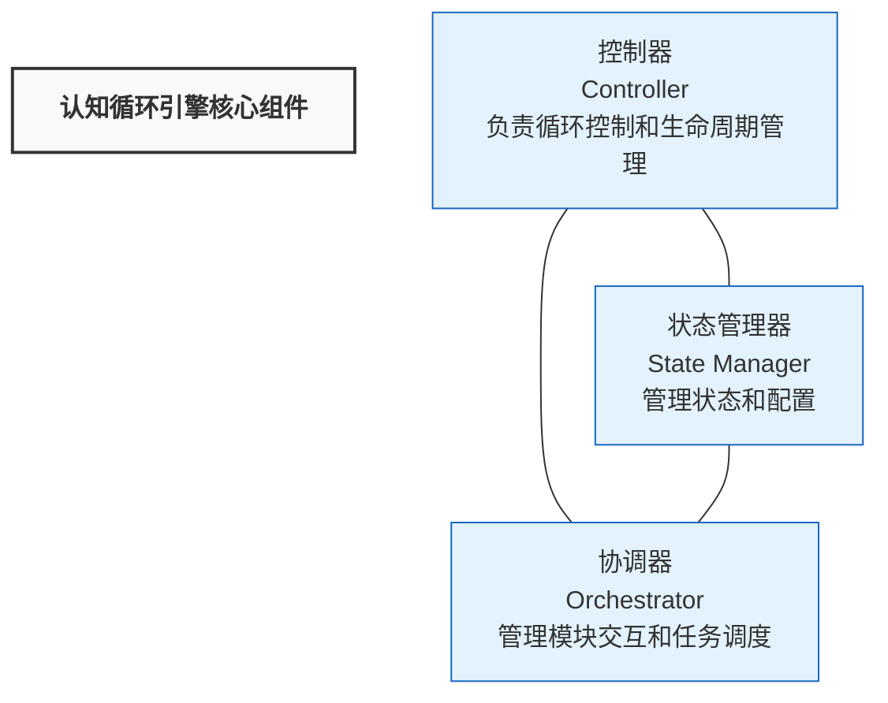

```mermaid
graph TB
    %% 总标题
    title[<b>认知循环引擎核心组件</b>]
    
    %% 主要组件
    Controller["控制器<br>Controller<br>负责循环控制和生命周期管理"]
    StateManager["状态管理器<br>State Manager<br>管理状态和配置"]
    Orchestrator["协调器<br>Orchestrator<br>管理模块交互和任务调度"]
    
    %% 组件间关系
    Controller --- StateManager
    Controller --- Orchestrator
    StateManager --- Orchestrator
    
    %% 样式设置
    classDef titleClass fill:#f9f9f9,stroke:#333,stroke-width:2px,font-weight:bold
    classDef componentClass fill:#e3f2fd,stroke:#1565c0,stroke-width:1px
    
    class title titleClass
    class Controller,StateManager,Orchestrator componentClass
```