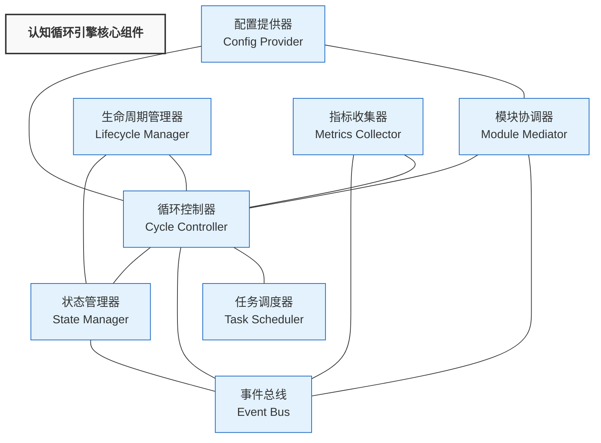

```mermaid
graph TB
    %% 总标题
    title[<b>认知循环引擎核心组件</b>]
    
    %% 主要组件
    CycleController["循环控制器<br>Cycle Controller"]
    StateManager["状态管理器<br>State Manager"]
    EventBus["事件总线<br>Event Bus"]
    TaskScheduler["任务调度器<br>Task Scheduler"]
    ModuleMediator["模块协调器<br>Module Mediator"]
    LifecycleManager["生命周期管理器<br>Lifecycle Manager"]
    ConfigProvider["配置提供器<br>Config Provider"]
    MetricsCollector["指标收集器<br>Metrics Collector"]
    
    %% 组件间关系
    CycleController --- StateManager
    CycleController --- EventBus
    CycleController --- TaskScheduler
    StateManager --- EventBus
    ModuleMediator --- CycleController
    ModuleMediator --- EventBus
    LifecycleManager --- StateManager
    LifecycleManager --- CycleController
    ConfigProvider --- CycleController
    ConfigProvider --- ModuleMediator
    MetricsCollector --- EventBus
    MetricsCollector --- CycleController
    
    %% 样式设置
    classDef titleClass fill:#f9f9f9,stroke:#333,stroke-width:2px,font-weight:bold
    classDef componentClass fill:#e3f2fd,stroke:#1565c0,stroke-width:1px
    
    class title titleClass
    class CycleController,StateManager,EventBus,TaskScheduler,ModuleMediator,LifecycleManager,ConfigProvider,MetricsCollector componentClass
```