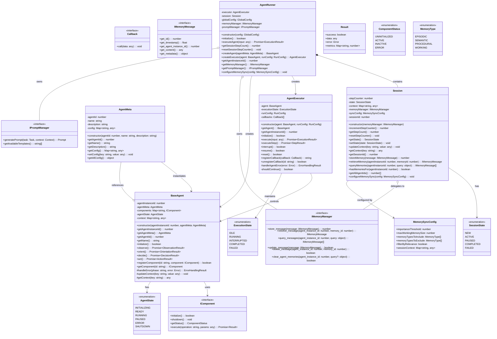

```mermaid
classDiagram
    %% 接口定义
    class IComponent {
        <<interface>>
        +initialize(): boolean
        +shutdown(): void
        +getStatus(): ComponentStatus
        +execute(operation: string, params: any): Promise~Result~
    }
    
    %% 回调接口
    class Callback {
        <<interface>>
        +call(data: any): void
    }
    
    %% 记忆消息接口(简化版)
    class IMemoryMessage {
        <<interface>>
        +get_id(): number
        +get_timestamp(): float
        +get_agent_instance_id(): number
        +get_content(): any
        +get_metadata(): object
    }
    
    %% 记忆管理器接口(简化版)
    class IMemoryManager {
        <<interface>>
        +store_message(message: IMemoryMessage): number
        +retrieve_message(agent_instance_id: number, memory_id: number): IMemoryMessage
        +query_messages(agent_instance_id: number, query: object): IMemoryMessage[]
        +update_message(message: IMemoryMessage): boolean
        +delete_message(agent_instance_id: number, memory_id: number): boolean
        +clear_agent_memories(agent_instance_id: number, query?: object): boolean
    }
    
    %% 提示词管理器接口(简化版)
    class IPromptManager {
        <<interface>>
        +generatePrompt(task: Task, context: Context): Prompt
        +getAvailableTemplates(): string[]
    }
    
    %% Agent元信息类
    class AgentMeta {
        -agentId: number
        -name: string
        -description: string
        -config: Map~string, any~
        +constructor(agentId: number, name: string, description: string)
        +getAgentId(): number
        +getName(): string
        +getDescription(): string
        +getConfig(): Map~string, any~
        +setConfig(key: string, value: any): void
        +getAllConfig(): object
    }
    
    %% 内部会话类
    class Session {
        -stepCounter: number
        -state: SessionState
        -context: Map~string, any~
        -memoryManager: IMemoryManager
        -syncConfig: MemorySyncConfig
        -sessionId: number
        +constructor(memoryManager: IMemoryManager)
        +incrementStepCounter(): number
        +getStepCount(): number
        +resetStepCounter(): void
        +getState(): SessionState
        +setState(state: SessionState): void
        +updateContext(key: string, value: any): void
        +getContext(key: string): any
        +getSessionId(): number
        +storeMemory(message: IMemoryMessage): number
        +retrieveMemory(agentInstanceId: number, memoryId: number): IMemoryMessage
        +queryMemories(agentInstanceId: number, query: object): IMemoryMessage[]
        +hasMemoriesFor(agentInstanceId: number): boolean
        +getAllAgentIds(): number[]
        +configureMemorySync(config: MemorySyncConfig): void
    }
    
    %% 记忆同步配置
    class MemorySyncConfig {
        +importanceThreshold: number
        +maxWorkingMemorySize: number
        +memoryTypesToInclude: MemoryType[]
        +memoryTypesToExclude: MemoryType[]
        +filterByRelevance: boolean
        +sessionContext: Map~string, any~
    }
    
    %% 核心类
    class BaseAgent {
        -agentInstanceId: number
        -agentMeta: AgentMeta
        -components: Map~string, IComponent~
        -agentState: AgentState
        -context: Map~string, any~
        +constructor(agentInstanceId: number, agentMeta: AgentMeta)
        +getAgentInstanceId(): number
        +getAgentMeta(): AgentMeta
        +getAgentId(): number
        +getName(): string
        +initialize(): boolean
        +observe(): Promise~ObservationResult~
        +orient(): Promise~OrientationResult~
        +decide(): Promise~DecisionResult~
        +act(): Promise~ActionResult~
        +registerComponent(id: string, component: IComponent): boolean
        +getComponent(id: string): IComponent
        #handleError(phase: string, error: Error): ErrorHandlingResult
        #updateContext(key: string, value: any): void
        #getContext(key: string): any
    }
    
    class AgentExecutor {
        -agent: BaseAgent
        -executionState: ExecutionState
        -runConfig: RunConfig
        -callbacks: Callback[]
        +constructor(agent: BaseAgent, runConfig: RunConfig)
        +getAgent(): BaseAgent
        +getAgentInstanceId(): number
        +initialize(): boolean
        +execute(input: any): Promise~ExecutionResult~
        +executeStep(): Promise~StepResult~
        +interrupt(): boolean
        +resume(): boolean
        +reset(): boolean
        +registerCallback(callback: Callback): string
        +unregisterCallback(id: string): boolean
        -handleAgentError(error: Error): ErrorHandlingResult
        -shouldContinue(): boolean
    }
    
    class AgentRunner {
        -executor: AgentExecutor
        -session: Session
        -globalConfig: GlobalConfig
        -memoryManager: IMemoryManager
        -promptManager: IPromptManager
        +constructor(config: GlobalConfig)
        +initialize(): boolean
        +executeAgent(input: any): Promise~ExecutionResult~
        +getSessionStepCount(): number
        +resetSessionStepCounter(): void
        +createAgent(agentMeta: AgentMeta): BaseAgent
        +createExecutor(agent: BaseAgent, runConfig: RunConfig): AgentExecutor
        +getAgentInstanceId(): number
        +getMemoryManager(): IMemoryManager
        +getPromptManager(): IPromptManager
        +configureMemorySync(config: MemorySyncConfig): void
    }
    
    %% 结果类
    class Result {
        +success: boolean
        +data: any
        +error: Error
        +metrics: Map~string, number~
    }
    
    %% 枚举和类型
    class AgentState {
        <<enumeration>>
        INITIALIZING
        READY
        RUNNING
        PAUSED
        ERROR
        SHUTDOWN
    }
    
    class ComponentStatus {
        <<enumeration>>
        UNINITIALIZED
        ACTIVE
        INACTIVE
        ERROR
    }
    
    class ExecutionState {
        <<enumeration>>
        IDLE
        RUNNING
        INTERRUPTED
        COMPLETED
        FAILED
    }
    
    class SessionState {
        <<enumeration>>
        NEW
        ACTIVE
        PAUSED
        COMPLETED
        FAILED
    }
    
    class MemoryType {
        <<enumeration>>
        EPISODIC
        SEMANTIC
        PROCEDURAL
        WORKING
    }
    
    %% 关系定义
    AgentMeta --> BaseAgent : instantiates
    AgentRunner *-- Session : contains
    AgentRunner --> AgentExecutor : creates
    AgentRunner --> BaseAgent : creates
    AgentRunner o-- IMemoryManager : owns
    AgentRunner o-- IPromptManager : owns
    AgentExecutor --> BaseAgent : controls
    BaseAgent --> IComponent : uses
    BaseAgent --> AgentState : has
    BaseAgent o-- AgentMeta : references
    AgentExecutor --> ExecutionState : maintains
    Session --> SessionState : has
    Session o-- IMemoryManager : delegates to
    Session --> MemorySyncConfig : configured by
```