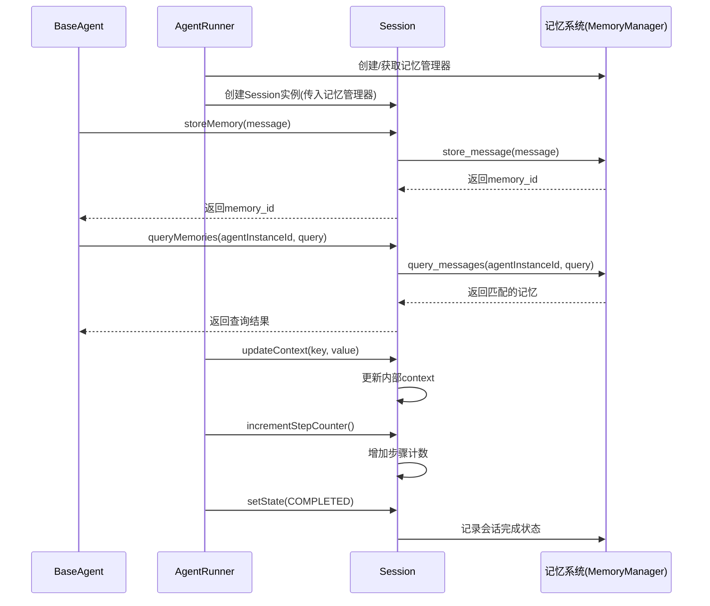

```mermaid
sequenceDiagram
    participant Agent as BaseAgent
    participant Runner as AgentRunner
    participant Session
    participant Memory as 记忆系统(MemoryManager)
    
    %% 初始化
    Runner->>Memory: 创建/获取记忆管理器
    Runner->>Session: 创建Session实例(传入记忆管理器)
    
    %% 记忆操作流程
    Agent->>Session: storeMemory(message)
    Session->>Memory: store_message(message)
    Memory-->>Session: 返回memory_id
    Session-->>Agent: 返回memory_id
    
    %% 记忆查询流程
    Agent->>Session: queryMemories(agentInstanceId, query)
    Session->>Memory: query_messages(agentInstanceId, query)
    Memory-->>Session: 返回匹配的记忆
    Session-->>Agent: 返回查询结果
    
    %% 会话上下文更新
    Runner->>Session: updateContext(key, value)
    Session->>Session: 更新内部context
    
    %% 步骤计数
    Runner->>Session: incrementStepCounter()
    Session->>Session: 增加步骤计数
    
    %% 会话结束
    Runner->>Session: setState(COMPLETED)
    Session->>Memory: 记录会话完成状态
```