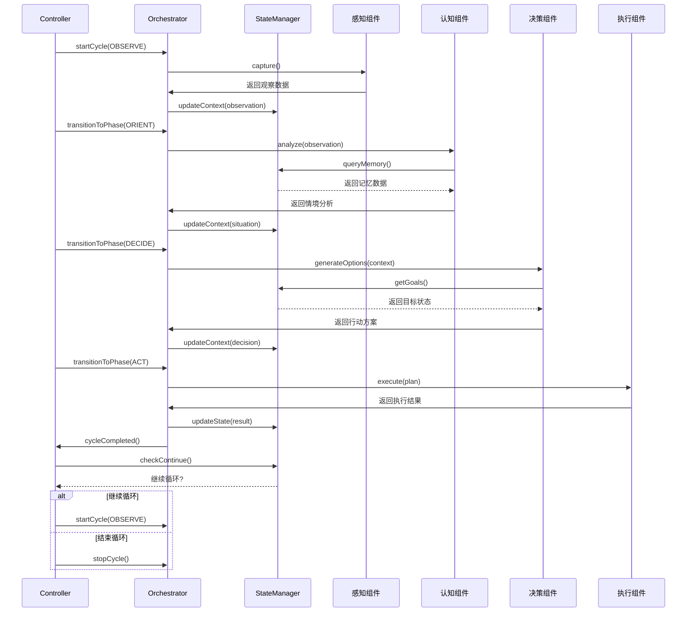

```mermaid
sequenceDiagram
    participant Controller
    participant Orchestrator
    participant StateManager
    participant Perception as 感知组件
    participant Cognition as 认知组件
    participant Decision as 决策组件
    participant Execution as 执行组件
    
    %% 观察阶段
    Controller->>Orchestrator: startCycle(OBSERVE)
    Orchestrator->>Perception: capture()
    Perception->>Orchestrator: 返回观察数据
    Orchestrator->>StateManager: updateContext(observation)
    
    %% 定向阶段
    Controller->>Orchestrator: transitionToPhase(ORIENT)
    Orchestrator->>Cognition: analyze(observation)
    Cognition->>StateManager: queryMemory()
    StateManager-->>Cognition: 返回记忆数据
    Cognition->>Orchestrator: 返回情境分析
    Orchestrator->>StateManager: updateContext(situation)
    
    %% 决策阶段
    Controller->>Orchestrator: transitionToPhase(DECIDE)
    Orchestrator->>Decision: generateOptions(context)
    Decision->>StateManager: getGoals()
    StateManager-->>Decision: 返回目标状态
    Decision->>Orchestrator: 返回行动方案
    Orchestrator->>StateManager: updateContext(decision)
    
    %% 行动阶段
    Controller->>Orchestrator: transitionToPhase(ACT)
    Orchestrator->>Execution: execute(plan)
    Execution->>Orchestrator: 返回执行结果
    Orchestrator->>StateManager: updateState(result)
    
    %% 循环控制
    Orchestrator->>Controller: cycleCompleted()
    Controller->>StateManager: checkContinue()
    StateManager-->>Controller: 继续循环?
    
    alt 继续循环
        Controller->>Orchestrator: startCycle(OBSERVE)
    else 结束循环
        Controller->>Orchestrator: stopCycle()
    end 
```