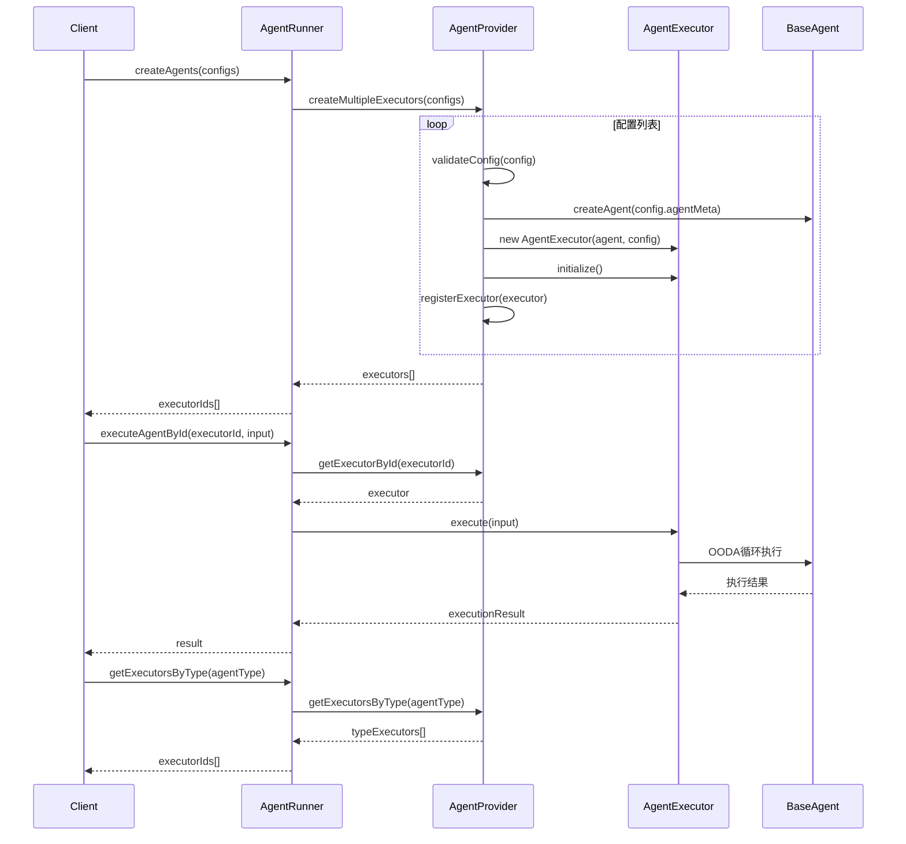

```mermaid
sequenceDiagram
    participant Client
    participant Runner as AgentRunner
    participant Provider as AgentProvider
    participant Executor as AgentExecutor
    participant Agent as BaseAgent
    
    %% 创建多个代理实例
    Client->>Runner: createAgents(configs)
    Runner->>Provider: createMultipleExecutors(configs)
    
    loop 配置列表
        Provider->>Provider: validateConfig(config)
        Provider->>Agent: createAgent(config.agentMeta)
        Provider->>Executor: new AgentExecutor(agent, config)
        Provider->>Executor: initialize()
        Provider->>Provider: registerExecutor(executor)
    end
    
    Provider-->>Runner: executors[]
    Runner-->>Client: executorIds[]
    
    %% 使用特定代理
    Client->>Runner: executeAgentById(executorId, input)
    Runner->>Provider: getExecutorById(executorId)
    Provider-->>Runner: executor
    Runner->>Executor: execute(input)
    Executor->>Agent: OODA循环执行
    Agent-->>Executor: 执行结果
    Executor-->>Runner: executionResult
    Runner-->>Client: result
    
    %% 按类型获取代理
    Client->>Runner: getExecutorsByType(agentType)
    Runner->>Provider: getExecutorsByType(agentType)
    Provider-->>Runner: typeExecutors[]
    Runner-->>Client: executorIds[]
```