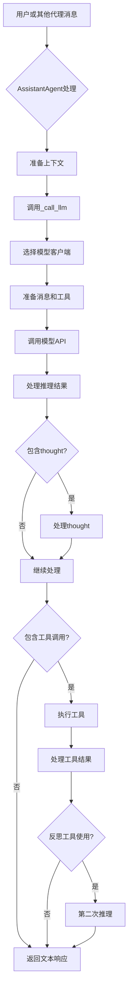

```mermaid
flowchart TD
    A[用户或其他代理消息] --> B{AssistantAgent处理}
    B --> C[准备上下文]
    C --> D[调用_call_llm]
    D --> E[选择模型客户端]
    E --> F[准备消息和工具]
    F --> G[调用模型API]
    G --> H[处理推理结果]
    H --> I{包含thought?}
    I -->|是| J[处理thought]
    I -->|否| K[继续处理]
    J --> K
    K --> L{包含工具调用?}
    L -->|是| M[执行工具]
    L -->|否| N[返回文本响应]
    M --> O[处理工具结果]
    O --> P{反思工具使用?}
    P -->|是| Q[第二次推理]
    P -->|否| N
    Q --> N
```