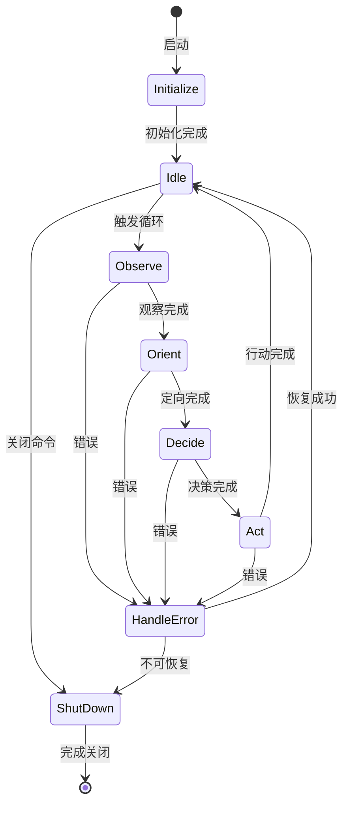

```mermaid
stateDiagram-v2
    [*] --> Initialize: 启动
    
    Initialize --> Idle: 初始化完成
    
    Idle --> Observe: 触发循环
    
    Observe --> Orient: 观察完成
    
    Orient --> Decide: 定向完成
    
    Decide --> Act: 决策完成
    
    Act --> Idle: 行动完成
    
    Idle --> ShutDown: 关闭命令
    
    ShutDown --> [*]: 完成关闭
    
    %% 错误处理
    Observe --> HandleError: 错误
    Orient --> HandleError: 错误
    Decide --> HandleError: 错误
    Act --> HandleError: 错误
    
    HandleError --> Idle: 恢复成功
    HandleError --> ShutDown: 不可恢复
```