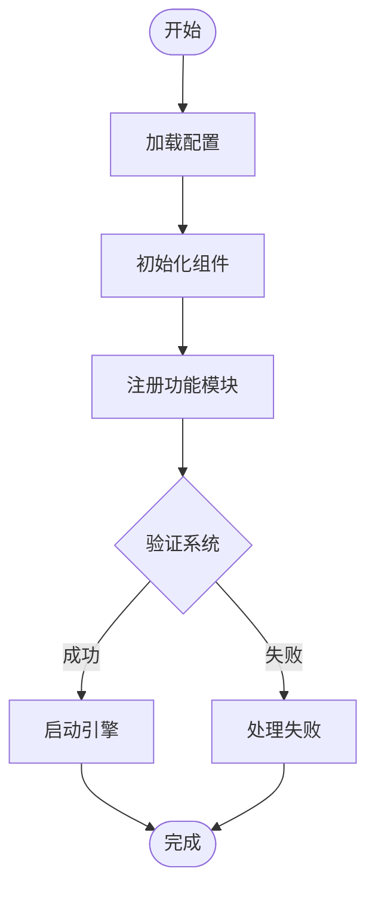

```mermaid
flowchart TD
    Start([开始]) --> LoadConfig["加载配置"]
    LoadConfig --> InitComponents["初始化组件"]
    InitComponents --> RegisterModules["注册功能模块"]
    RegisterModules --> ValidateSystem{"验证系统"}
    ValidateSystem -->|成功| StartEngine["启动引擎"]
    ValidateSystem -->|失败| HandleFailure["处理失败"]
    StartEngine --> End([完成])
    HandleFailure --> End
```