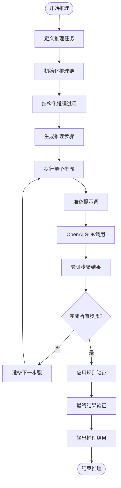

```mermaid
flowchart TD
    Start([开始推理]) --> DefineTask["定义推理任务"]
    DefineTask --> InitChain["初始化推理链"]
    
    InitChain --> StructureReasoning["结构化推理过程"]
    StructureReasoning --> GenerateSteps["生成推理步骤"]
    GenerateSteps --> ExecuteStep["执行单个步骤"]
    
    ExecuteStep --> PreparePrompt["准备提示词"]
    PreparePrompt --> CallOpenAI["OpenAI SDK调用"]
    CallOpenAI --> ValidateStep["验证步骤结果"]
    
    ValidateStep --> CheckComplete{"完成所有步骤?"}
    CheckComplete -->|"否"| NextStep["准备下一步骤"]
    NextStep --> ExecuteStep
    
    CheckComplete -->|"是"| ApplyRules["应用规则验证"]
    ApplyRules --> FinalValidation["最终结果验证"]
    
    FinalValidation --> Output["输出推理结果"]
    Output --> End([结束推理])
```