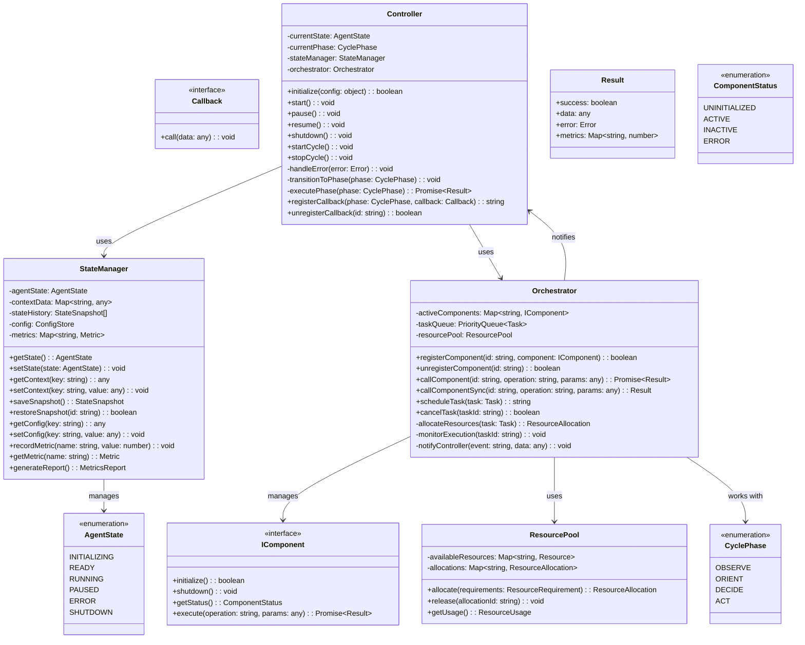

```mermaid
classDiagram
    %% 接口定义
    class IComponent {
        <<interface>>
        +initialize(): boolean
        +shutdown(): void
        +getStatus(): ComponentStatus
        +execute(operation: string, params: any): Promise~Result~
    }
    
    %% 回调接口
    class Callback {
        <<interface>>
        +call(data: any): void
    }
    
    %% 核心类
    class Controller {
        -currentState: AgentState
        -currentPhase: CyclePhase
        -stateManager: StateManager
        -orchestrator: Orchestrator
        +initialize(config: object): boolean
        +start(): void
        +pause(): void
        +resume(): void
        +shutdown(): void
        +startCycle(): void
        +stopCycle(): void
        -handleError(error: Error): void
        -transitionToPhase(phase: CyclePhase): void
        -executePhase(phase: CyclePhase): Promise~Result~
        +registerCallback(phase: CyclePhase, callback: Callback): string
        +unregisterCallback(id: string): boolean
    }
    
    class StateManager {
        -agentState: AgentState
        -contextData: Map~string, any~
        -stateHistory: StateSnapshot[]
        -config: ConfigStore
        -metrics: Map~string, Metric~
        +getState(): AgentState
        +setState(state: AgentState): void
        +getContext(key: string): any
        +setContext(key: string, value: any): void
        +saveSnapshot(): StateSnapshot
        +restoreSnapshot(id: string): boolean
        +getConfig(key: string): any
        +setConfig(key: string, value: any): void
        +recordMetric(name: string, value: number): void
        +getMetric(name: string): Metric
        +generateReport(): MetricsReport
    }
    
    class Orchestrator {
        -activeComponents: Map~string, IComponent~
        -taskQueue: PriorityQueue~Task~
        -resourcePool: ResourcePool
        +registerComponent(id: string, component: IComponent): boolean
        +unregisterComponent(id: string): boolean
        +callComponent(id: string, operation: string, params: any): Promise~Result~
        +callComponentSync(id: string, operation: string, params: any): Result
        +scheduleTask(task: Task): string
        +cancelTask(taskId: string): boolean
        -allocateResources(task: Task): ResourceAllocation
        -monitorExecution(taskId: string): void
        -notifyController(event: string, data: any): void
    }
    
    %% 辅助类
    class ResourcePool {
        -availableResources: Map~string, Resource~
        -allocations: Map~string, ResourceAllocation~
        +allocate(requirements: ResourceRequirement): ResourceAllocation
        +release(allocationId: string): void
        +getUsage(): ResourceUsage
    }
    
    %% 结果类
    class Result {
        +success: boolean
        +data: any
        +error: Error
        +metrics: Map~string, number~
    }
    
    %% 枚举和类型
    class AgentState {
        <<enumeration>>
        INITIALIZING
        READY
        RUNNING
        PAUSED
        ERROR
        SHUTDOWN
    }
    
    class CyclePhase {
        <<enumeration>>
        OBSERVE
        ORIENT
        DECIDE
        ACT
    }
    
    class ComponentStatus {
        <<enumeration>>
        UNINITIALIZED
        ACTIVE
        INACTIVE
        ERROR
    }
    
    %% 关系定义
    Controller --> StateManager : uses
    Controller --> Orchestrator : uses
    StateManager --> AgentState : manages
    Orchestrator --> IComponent : manages
    Orchestrator --> ResourcePool : uses
    Orchestrator --> CyclePhase : works with
    Orchestrator --> Controller : notifies
```