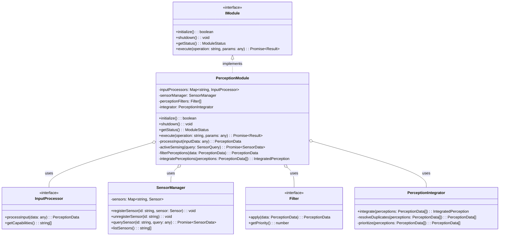

```mermaid
classDiagram
    class IModule {
        <<interface>>
        +initialize(): boolean
        +shutdown(): void
        +getStatus(): ModuleStatus
        +execute(operation: string, params: any): Promise~Result~
    }
    
    class PerceptionModule {
        -inputProcessors: Map~string, InputProcessor~
        -sensorManager: SensorManager
        -perceptionFilters: Filter[]
        -integrator: PerceptionIntegrator
        +initialize(): boolean
        +shutdown(): void
        +getStatus(): ModuleStatus
        +execute(operation: string, params: any): Promise~Result~
        -processInput(inputData: any): PerceptionData
        -activeSensing(query: SensorQuery): Promise~SensorData~
        -filterPerceptions(data: PerceptionData): PerceptionData
        -integratePerceptions(perceptions: PerceptionData[]): IntegratedPerception
    }
    
    class InputProcessor {
        <<interface>>
        +processInput(data: any): PerceptionData
        +getCapabilities(): string[]
    }
    
    class SensorManager {
        -sensors: Map~string, Sensor~
        +registerSensor(id: string, sensor: Sensor): void
        +unregisterSensor(id: string): void
        +querySensor(id: string, query: any): Promise~SensorData~
        +listSensors(): string[]
    }
    
    class Filter {
        <<interface>>
        +apply(data: PerceptionData): PerceptionData
        +getPriority(): number
    }
    
    class PerceptionIntegrator {
        +integrate(perceptions: PerceptionData[]): IntegratedPerception
        -resolveDuplicates(perceptions: PerceptionData[]): PerceptionData[]
        -prioritize(perceptions: PerceptionData[]): PerceptionData[]
    }
    
    IModule <|.. PerceptionModule : implements
    PerceptionModule o-- InputProcessor : uses
    PerceptionModule o-- SensorManager : uses
    PerceptionModule o-- Filter : uses
    PerceptionModule o-- PerceptionIntegrator : uses
```