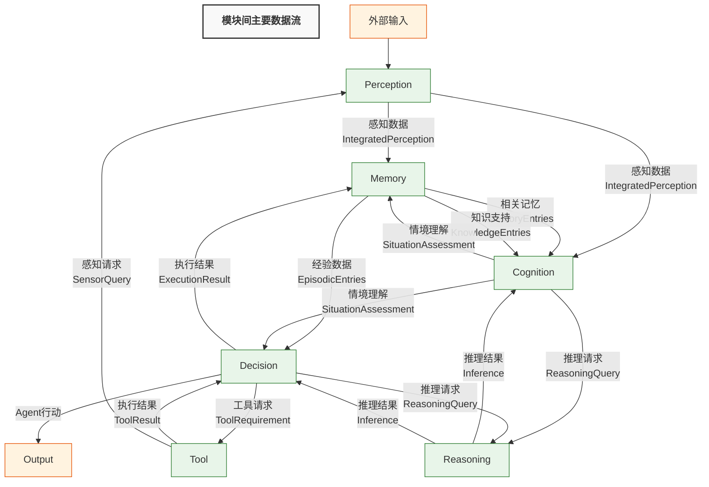

```mermaid
graph TD
    %% 总标题
    title[<b>模块间主要数据流</b>]
    
    %% 数据流
    Input["外部输入"] --> Perception
    
    Perception --> |"感知数据<br>IntegratedPerception"| Memory
    Perception --> |"感知数据<br>IntegratedPerception"| Cognition
    
    Memory --> |"相关记忆<br>MemoryEntries"| Cognition
    Memory --> |"知识支持<br>KnowledgeEntries"| Cognition
    Memory --> |"经验数据<br>EpisodicEntries"| Decision
    
    Cognition --> |"情境理解<br>SituationAssessment"| Memory
    Cognition --> |"情境理解<br>SituationAssessment"| Decision
    Cognition --> |"推理请求<br>ReasoningQuery"| Reasoning
    
    Reasoning --> |"推理结果<br>Inference"| Cognition
    Reasoning --> |"推理结果<br>Inference"| Decision
    
    Decision --> |"执行结果<br>ExecutionResult"| Memory
    Decision --> |"工具请求<br>ToolRequirement"| Tool
    Decision --> |"推理请求<br>ReasoningQuery"| Reasoning
    
    Tool --> |"执行结果<br>ToolResult"| Decision
    Tool --> |"感知请求<br>SensorQuery"| Perception
    
    Decision --> |"Agent行动"| Output
    
    %% 样式设置
    classDef titleClass fill:#f9f9f9,stroke:#333,stroke-width:2px,font-weight:bold
    classDef moduleClass fill:#e8f5e9,stroke:#2e7d32,stroke-width:1px
    classDef dataClass fill:#e3f2fd,stroke:#1565c0,stroke-width:1px
    classDef externalClass fill:#fff3e0,stroke:#e65100,stroke-width:1px
    
    class title titleClass
    class Perception,Cognition,Decision,Memory,Reasoning,Tool moduleClass
    class Input,Output externalClass
```