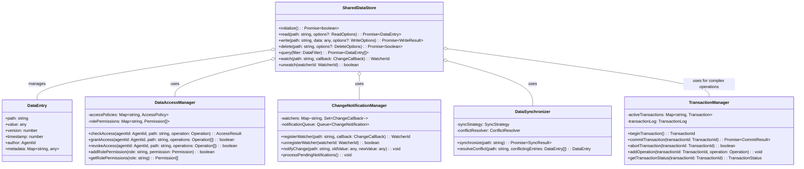

```mermaid
classDiagram
    class SharedDataStore {
        +initialize(): Promise~boolean~
        +read(path: string, options?: ReadOptions): Promise~DataEntry~
        +write(path: string, data: any, options?: WriteOptions): Promise~WriteResult~
        +delete(path: string, options?: DeleteOptions): Promise~boolean~
        +query(filter: DataFilter): Promise~DataEntry[]~
        +watch(path: string, callback: ChangeCallback): WatcherId
        +unwatch(watcherId: WatcherId): boolean
    }
    
    class DataEntry {
        +path: string
        +value: any
        +version: number
        +timestamp: number
        +author: AgentId
        +metadata: Map~string, any~
    }
    
    class DataAccessManager {
        -accessPolicies: Map~string, AccessPolicy~
        -rolePermissions: Map~string, Permission[]~
        +checkAccess(agentId: AgentId, path: string, operation: Operation): AccessResult
        +grantAccess(agentId: AgentId, path: string, operations: Operation[]): boolean
        +revokeAccess(agentId: AgentId, path: string, operations: Operation[]): boolean
        +addRolePermission(role: string, permission: Permission): boolean
        +getRolePermissions(role: string): Permission[]
    }
    
    class ChangeNotificationManager {
        -watchers: Map~string, Set~ChangeCallback~~
        -notificationQueue: Queue~ChangeNotification~
        +registerWatcher(path: string, callback: ChangeCallback): WatcherId
        +unregisterWatcher(watcherId: WatcherId): boolean
        +notifyChange(path: string, oldValue: any, newValue: any): void
        +processPendingNotifications(): void
    }
    
    class DataSynchronizer {
        -syncStrategy: SyncStrategy
        -conflictResolver: ConflictResolver
        +synchronize(path: string): Promise~SyncResult~
        +resolveConflict(path: string, conflictingEntries: DataEntry[]): DataEntry
    }
    
    class TransactionManager {
        -activeTransactions: Map~string, Transaction~
        -transactionLog: TransactionLog
        +beginTransaction(): TransactionId
        +commitTransaction(transactionId: TransactionId): Promise~CommitResult~
        +abortTransaction(transactionId: TransactionId): boolean
        +addOperation(transactionId: TransactionId, operation: Operation): void
        +getTransactionStatus(transactionId: TransactionId): TransactionStatus
    }
    
    SharedDataStore o-- DataEntry : manages
    SharedDataStore o-- DataAccessManager : uses
    SharedDataStore o-- ChangeNotificationManager : uses
    SharedDataStore o-- DataSynchronizer : uses
    SharedDataStore o-- TransactionManager : uses for complex operations
```