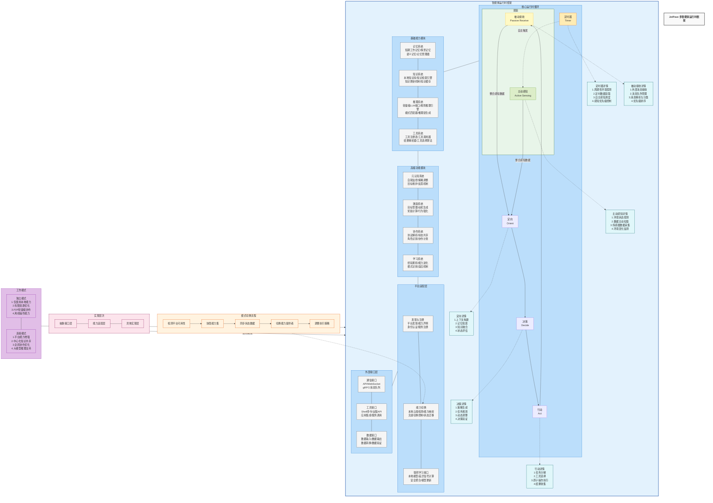

```mermaid
graph TB
    %% 总标题
    title[<b>JetPave 多智能体运行时框架</b>]
    
    %% 总体框架
    subgraph AgentRuntime["智能体运行时框架"]
        direction TB
        
        %% 核心运行时循环
        subgraph CoreLoop["核心运行时循环"]
            direction LR
            
            %% 观察细分为主动和被动两部分
            subgraph Observe["观察<br>Observe"]
                direction TB
                PassiveReceive["被动接收<br>Passive Receive"] 
                ActiveSense["主动感知<br>Active Sensing"]
            end
            
            Timer["定时器<br>Timer"] -.->|"自主触发"| ActiveSense
            PassiveReceive -->|"整合感知数据"| Orient["定向<br>Orient"]
            ActiveSense -->|"整合感知数据"| Orient
            Orient --> Decide["决策<br>Decide"] --> Act["行动<br>Act"] 
            Act --> PassiveReceive
        end
        
        %% 进一步描述OODA循环各组件
        TimerDetail["定时器详情<br>1.周期性环境探测<br>2.定时数据获取<br>3.自主感知调度<br>4.感知优先级控制"]
        
        %% 观察组件细分详情
        PassiveDetail["被动接收详情<br>1.外部消息接收<br>2.消息队列管理<br>3.消息解析与分类<br>4.优先级排序"]
        ActiveDetail["主动感知详情<br>1.环境状态探测<br>2.数据主动拉取<br>3.传感器数据采集<br>4.环境变化监测"]
        
        OrientDetail["定向详情<br>1.上下文构建<br>2.记忆检索<br>3.知识融合<br>4.状态评估"] 
        DecideDetail["决策详情<br>1.策略生成<br>2.任务规划<br>3.动态调整<br>4.决策验证"]
        ActDetail["行动详情<br>1.任务分解<br>2.工具选择<br>3.原子操作执行<br>4.结果收集"]
        
        %% 基础能力模块
        subgraph BaseCapabilities["基础能力模块"]
            direction TB
            
            %% 记忆系统
            MemorySystem["记忆系统<br>短期工作记忆/情景记忆<br>语义记忆/记忆管理器"]
            
            %% 知识系统
            KnowledgeSystem["知识系统<br>本地知识库/知识检索引擎<br>知识更新机制/知识缓存"]
            
            %% 推理系统
            ReasoningSystem["推理系统<br>轻量级LLM接口/规则推理引擎<br>模式匹配器/推理链生成"]
            
            %% 工具系统
            ToolSystem["工具系统<br>工具注册表/工具调用器<br>结果解析器/工具选择算法"]
            
            %% 基础能力连接
            MemorySystem --- KnowledgeSystem
            KnowledgeSystem --- ReasoningSystem
            ReasoningSystem --- ToolSystem
        end
        
        %% 高级功能模块
        subgraph AdvancedModules["高级功能模块"]
            direction TB
            
            %% 元认知系统
            MetaCognition["元认知系统<br>自我监控/策略调整<br>目标维护/反思机制"]
            
            %% 激励系统
            IncentiveSystem["激励系统<br>目标管理/动机生成<br>奖励计算/行为强化"]
            
            %% 协作系统
            CollaborationSystem["协作系统<br>协议解析/状态共享<br>角色识别/协作计划"]
            
            %% 学习系统
            LearningSystem["学习系统<br>经验累积/能力进化<br>模式识别/适应机制"]
            
            %% 高级功能连接
            MetaCognition --- IncentiveSystem
            IncentiveSystem --- CollaborationSystem
            CollaborationSystem --- LearningSystem
        end
        
        %% 平台适配层
        subgraph PlatformAdapter["平台适配层"]
            direction TB
            
            %% 发现与注册
            DiscoveryReg["发现与注册<br>平台发现/能力声明<br>身份认证/服务注册"]
            
            %% 能力切换
            CapabilitySwitch["能力切换<br>本地云端检测/能力映射<br>无缝切换控制/状态迁移"]
            
            %% 联邦学习接口
            FederatedLearning["联邦学习接口<br>本地模型/差异信号计算<br>安全聚合/模型更新"]
            
            %% 平台适配层连接
            DiscoveryReg --- CapabilitySwitch
            CapabilitySwitch --- FederatedLearning
        end
        
        %% 外部接口层
        subgraph ExternalInterfaces["外部接口层"]
            direction TB
            
            %% 通信接口
            CommInterfaces["通信接口<br>API/WebSocket<br>gRPC/消息队列"]
            
            %% 工具接口
            ToolInterfaces["工具接口<br>Shell命令/远程API<br>应用集成/服务调用"]
            
            %% 数据接口
            DataInterfaces["数据接口<br>数据输入/数据输出<br>数据转换/数据验证"]
            
            %% 外部接口连接
            CommInterfaces --- ToolInterfaces
            ToolInterfaces --- DataInterfaces
        end
        
        %% 主要模块间的连接关系
        CoreLoop --- BaseCapabilities
        BaseCapabilities --- AdvancedModules
        AdvancedModules --- PlatformAdapter
        PlatformAdapter --- ExternalInterfaces
        
        %% OODA循环关联
        Timer -.-> TimerDetail
        PassiveReceive -.-> PassiveDetail
        ActiveSense -.-> ActiveDetail
        Orient -.-> OrientDetail
        Decide -.-> DecideDetail
        Act -.-> ActDetail
    end
    
    %% 工作模式
    subgraph WorkModes["工作模式"]
        direction TB
        
        %% 独立模式
        StandaloneMode["独立模式<br>1.仅使用本地能力<br>2.有限资源优化<br>3.P2P轻量级协作<br>4.离线操作能力"]
        
        %% 连接模式
        ConnectedMode["连接模式<br>1.平台能力增强<br>2.中心化知识共享<br>3.全局协作优化<br>4.大模型推理支持"]
        
        %% 工作模式连接
        StandaloneMode --- ConnectedMode
    end
    
    %% 模式切换流程
    subgraph ModeSwitching["模式切换流程"]
        direction LR
        MS1["检测平台可用性"] --> MS2["协商能力集"] --> MS3["同步状态数据"] --> MS4["切换能力提供者"] --> MS5["调整执行策略"]
    end
    
    %% 实现层次
    subgraph ImplementationLayers["实现层次"]
        direction LR
        IL1["抽象接口层"] --- IL2["能力适配层"] --- IL3["具体实现层"]
    end
    
    %% 主要外部连接关系
    WorkModes -->|"影响模块能力"| AgentRuntime
    ImplementationLayers -->|"技术实现"| AgentRuntime
    ModeSwitching -.-> CapabilitySwitch
    
    %% 样式设置
    classDef titleClass fill:#f9f9f9,stroke:#333,stroke-width:2px,font-weight:bold
    classDef mainGroupClass fill:#e3f2fd,stroke:#0d47a1,stroke-width:2px
    classDef subGroupClass fill:#bbdefb,stroke:#1976d2,stroke-width:1px
    classDef loopClass fill:#e8f5e9,stroke:#1b5e20,stroke-width:1px
    classDef componentClass fill:#f5f5f5,stroke:#616161,stroke-width:1px
    classDef modeClass fill:#e1bee7,stroke:#8e24aa,stroke-width:1px
    classDef switchClass fill:#fff3e0,stroke:#e65100,stroke-width:1px
    classDef layerClass fill:#fce4ec,stroke:#880e4f,stroke-width:1px
    classDef detailClass fill:#e0f7fa,stroke:#006064,stroke-width:1px
    classDef timerClass fill:#ffecb3,stroke:#ff6f00,stroke-width:1px
    classDef activeClass fill:#dcedc8,stroke:#689f38,stroke-width:1px
    classDef passiveClass fill:#fff9c4,stroke:#fbc02d,stroke-width:1px
    
    class title titleClass
    class AgentRuntime mainGroupClass
    class CoreLoop,BaseCapabilities,AdvancedModules,PlatformAdapter,ExternalInterfaces subGroupClass
    class Observe loopClass
    class PassiveDetail,ActiveDetail,OrientDetail,DecideDetail,ActDetail,TimerDetail detailClass
    class Timer timerClass
    class ActiveSense activeClass
    class PassiveReceive passiveClass
    class MemorySystem,KnowledgeSystem,ReasoningSystem,ToolSystem componentClass
    class MetaCognition,IncentiveSystem,CollaborationSystem,LearningSystem componentClass
    class DiscoveryReg,CapabilitySwitch,FederatedLearning componentClass
    class CommInterfaces,ToolInterfaces,DataInterfaces componentClass
    class WorkModes,StandaloneMode,ConnectedMode modeClass
    class ModeSwitching,MS1,MS2,MS3,MS4,MS5 switchClass
    class ImplementationLayers,IL1,IL2,IL3 layerClass
```