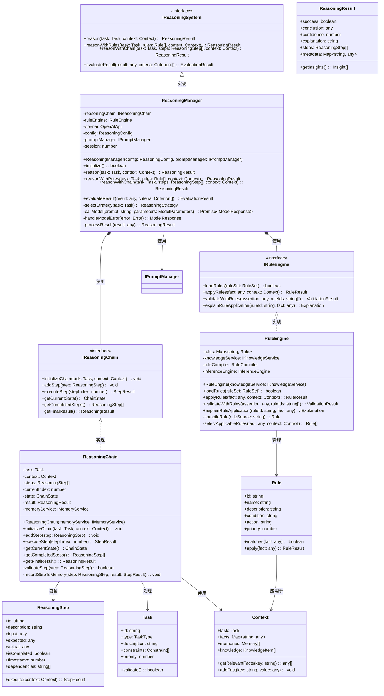

```mermaid
classDiagram
    %% 接口定义
    class IReasoningSystem {
        <<interface>>
        +reason(task: Task, context: Context): ReasoningResult
        +reasonWithRules(task: Task, rules: Rule[], context: Context): ReasoningResult
        +reasonWithChain(task: Task, steps: ReasoningStep[], context: Context): ReasoningResult
        +evaluateResult(result: any, criteria: Criterion[]): EvaluationResult
    }
    
    class IReasoningChain {
        <<interface>>
        +initializeChain(task: Task, context: Context): void
        +addStep(step: ReasoningStep): void
        +executeStep(stepIndex: number): StepResult
        +getCurrentState(): ChainState
        +getCompletedSteps(): ReasoningStep[]
        +getFinalResult(): ReasoningResult
    }
    
    class IRuleEngine {
        <<interface>>
        +loadRules(ruleSet: RuleSet): boolean
        +applyRules(fact: any, context: Context): RuleResult
        +validateWithRules(assertion: any, ruleIds: string[]): ValidationResult
        +explainRuleApplication(ruleId: string, fact: any): Explanation
    }
    
    %% 实现类
    class ReasoningManager {
        -reasoningChain: IReasoningChain
        -ruleEngine: IRuleEngine
        -openai: OpenAIApi
        -config: ReasoningConfig
        -promptManager: IPromptManager
        -session: number
        +ReasoningManager(config: ReasoningConfig, promptManager: IPromptManager)
        +initialize(): boolean
        +reason(task: Task, context: Context): ReasoningResult
        +reasonWithRules(task: Task, rules: Rule[], context: Context): ReasoningResult
        +reasonWithChain(task: Task, steps: ReasoningStep[], context: Context): ReasoningResult
        +evaluateResult(result: any, criteria: Criterion[]): EvaluationResult
        -selectStrategy(task: Task): ReasoningStrategy
        -callModel(prompt: string, parameters: ModelParameters): Promise~ModelResponse~
        -handleModelError(error: Error): ModelResponse
        -processResult(result: any): ReasoningResult
    }
    
    class ReasoningChain {
        -task: Task
        -context: Context
        -steps: ReasoningStep[]
        -currentIndex: number
        -state: ChainState
        -result: ReasoningResult
        -memoryService: IMemoryService
        +ReasoningChain(memoryService: IMemoryService)
        +initializeChain(task: Task, context: Context): void
        +addStep(step: ReasoningStep): void
        +executeStep(stepIndex: number): StepResult
        +getCurrentState(): ChainState
        +getCompletedSteps(): ReasoningStep[]
        +getFinalResult(): ReasoningResult
        -validateStep(step: ReasoningStep): boolean
        -recordStepToMemory(step: ReasoningStep, result: StepResult): void
    }
    
    class RuleEngine {
        -rules: Map~string, Rule~
        -knowledgeService: IKnowledgeService
        -ruleCompiler: RuleCompiler
        -inferenceEngine: InferenceEngine
        +RuleEngine(knowledgeService: IKnowledgeService)
        +loadRules(ruleSet: RuleSet): boolean
        +applyRules(fact: any, context: Context): RuleResult
        +validateWithRules(assertion: any, ruleIds: string[]): ValidationResult
        +explainRuleApplication(ruleId: string, fact: any): Explanation
        -compileRule(ruleSource: string): Rule
        -selectApplicableRules(fact: any, context: Context): Rule[]
    }
    
    %% 数据类
    class Task {
        +id: string
        +type: TaskType
        +description: string
        +constraints: Constraint[]
        +priority: number
        +validate(): boolean
    }
    
    class Context {
        +task: Task
        +facts: Map~string, any~
        +memories: Memory[]
        +knowledge: KnowledgeItem[]
        +getRelevantFacts(key: string): any[]
        +addFact(key: string, value: any): void
    }
    
    class ReasoningStep {
        +id: string
        +description: string
        +input: any
        +expected: any
        +actual: any
        +isCompleted: boolean
        +timestamp: number
        +dependencies: string[]
        +execute(context: Context): StepResult
    }
    
    class ReasoningResult {
        +success: boolean
        +conclusion: any
        +confidence: number
        +explanation: string
        +steps: ReasoningStep[]
        +metadata: Map~string, any~
        +getInsights(): Insight[]
    }
    
    class Rule {
        +id: string
        +name: string
        +description: string
        +condition: string
        +action: string
        +priority: number
        +matches(fact: any): boolean
        +apply(fact: any): RuleResult
    }
    
    %% 关系定义
    IReasoningSystem <|.. ReasoningManager : 实现
    IReasoningChain <|.. ReasoningChain : 实现
    IRuleEngine <|.. RuleEngine : 实现
    
    ReasoningManager *-- IReasoningChain : 使用
    ReasoningManager *-- IRuleEngine : 使用
    ReasoningManager --> IPromptManager : 使用
    
    ReasoningChain --> ReasoningStep : 包含
    ReasoningChain --> Task : 处理
    ReasoningChain --> Context : 使用
    RuleEngine --> Rule : 管理
    Rule --> Context : 应用于
```