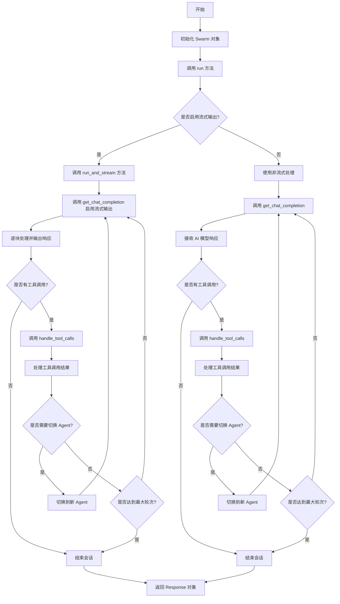

```mermaid
```mermaid
graph TD
    A[开始] --> B[初始化 Swarm 对象]
    B --> C[调用 run 方法]
    C --> D{是否启用流式输出?}
    D -->|是| E[调用 run_and_stream 方法]
    D -->|否| F[使用非流式处理]
    
    %% 非流式处理流程
    F --> G[调用 get_chat_completion]
    G --> H[接收 AI 模型响应]
    H --> I{是否有工具调用?}
    I -->|否| J[结束会话]
    I -->|是| K[调用 handle_tool_calls]
    K --> L[处理工具调用结果]
    L --> M{是否需要切换 Agent?}
    M -->|是| N[切换到新 Agent]
    N --> G
    M -->|否| O{是否达到最大轮次?}
    O -->|是| J
    O -->|否| G
    
    %% 流式处理流程
    E --> P[调用 get_chat_completion 启用流式输出]
    P --> Q[逐块处理并输出响应]
    Q --> R{是否有工具调用?}
    R -->|否| S[结束会话]
    R -->|是| T[调用 handle_tool_calls]
    T --> U[处理工具调用结果]
    U --> V{是否需要切换 Agent?}
    V -->|是| W[切换到新 Agent]
    W --> P
    V -->|否| X{是否达到最大轮次?}
    X -->|是| S
    X -->|否| P
    
    J --> Z[返回 Response 对象]
    S --> Z
```
```