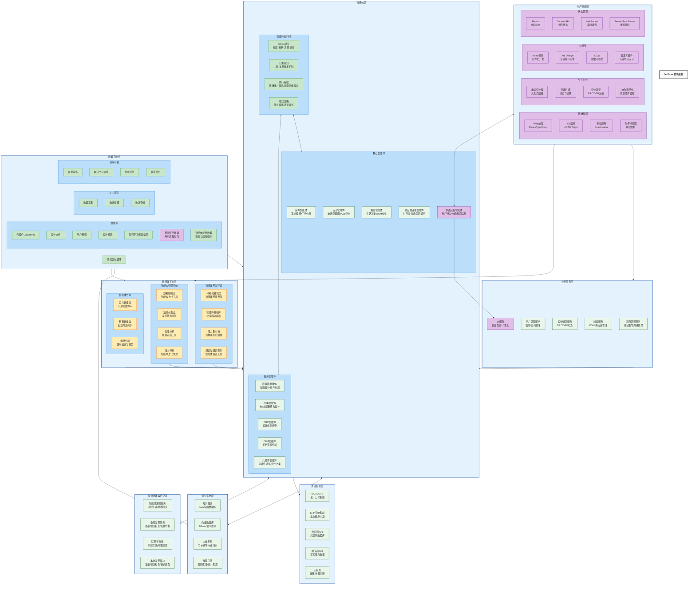

```mermaid
```mermaid
graph TB
    %% 标题
    title[<b>JetPave 技术架构</b>]
    
    %% 用户界面层
    subgraph UILayer["用户界面层"]
        %% 基础界面
        subgraph BasicUI["基础界面"]
            Web["Web前端<br>React/TypeScript"]
            IDE["IDE插件<br>KiCAD Plugin"]
            Mobile["移动应用<br>React Native"]
            CLI["命令行界面<br>基础控制"]
        end
        
        %% 交互组件
        subgraph InteractionComponents["交互组件"]
            CircuitDesigner["电路设计器<br>交互式绘图"]
            ComponentLibrary["元器件库<br>浏览与选择"]
            DesignValidator["设计验证<br>DRC/DFM反馈"]
            CollaborationView["协作可视化<br>多智能体监控"]
        end
        
        %% UI框架
        subgraph UIFramework["UI框架"]
            ReactFramework["React框架<br>组件化开发"]
            AntDesign["Ant Design<br>企业级UI组件"]
            D3Visualizations["D3.js<br>数据可视化"]
            CustomComponents["自定义组件<br>专业电子设计"]
        end
        
        %% 状态管理
        subgraph StateManagement["状态管理"]
            Redux["Redux<br>全局状态"]
            ContextAPI["Context API<br>组件状态"]
            WebSocket["WebSocket<br>实时通讯"]
            SSE["Server-Sent Events<br>推送通知"]
        end
    end
    
    %% 业务服务层
    subgraph ServiceLayer["业务服务层"]
        ProjectMgmt["项目管理服务<br>项目生命周期管理"]
        UserMgmt["用户管理服务<br>权限/订阅管理"]
        DesignService["设计辅助服务<br>DRC/DFM检查"]
        ManufacturingService["制造服务<br>BOM/供应链管理"]
        UIService["UI服务<br>界面配置/个性化"]
    end
    
    %% 智能体平台层
    subgraph AgentPlatformLayer["智能体平台层"]
        %% 智能体开发环境
        subgraph DevEnvironment["智能体开发环境"]
            VisualEditor["可视化编辑器<br>智能体配置界面"]
            TemplateLibrary["智能体模板库<br>快速启动模板"]
            CapabilityMarket["能力集市场<br>预构建能力模块"]
            TestSuite["测试与调试套件<br>智能体验证工具"]
        end
        
        %% 智能体管理系统
        subgraph ManagementSystem["智能体管理系统"]
            Deployment["部署控制台<br>智能体上线工具"]
            Monitoring["监控仪表盘<br>运行状态监控"]
            Performance["性能分析<br>瓶颈诊断工具"]
            VersionControl["版本控制<br>智能体迭代管理"]
        end
        
        %% 智能体市场
        subgraph AgentMarket["智能体市场"]
            PublicAgents["公共智能体<br>开源智能体库"]
            PrivateAgents["私有智能体<br>企业内部共享"]
            MarketAnalytics["市场分析<br>使用统计与趋势"]
        end
    end
    
    %% 智能体层
    subgraph AgentLayer["智能体层"]
        %% 核心智能体
        subgraph CoreAgents["核心智能体"]
            UserAgent["用户智能体<br>需求理解/任务分解"]
            DesignAgent["设计智能体<br>电路原理图/PCB设计"]
            ManufacturingAgent["制造智能体<br>工艺决策/BOM优化"]
            SupplierEvaluationAgent["供应商评估智能体<br>供应商筛选/风险评估"]
            UIAgent["界面交互智能体<br>用户行为分析/界面适配"]
        end
        
        %% 智能体运行时
        subgraph AgentRuntime["智能体运行时"]
            OODALoop["OODA循环<br>观察-判断-决策-行动"]
            AutonomousTimers["自主感知<br>主动/被动触发机制"]
            ExecutionSystem["执行系统<br>基础能力模块/高级功能模块"]
            ModeSwitching["模式切换<br>独立模式/连接模式"]
        end
        
        %% 任务智能体
        subgraph TaskAgents["任务智能体"]
            SchematicAgent["原理图智能体<br>电路设计/组件布局"]
            PCBAgent["PCB智能体<br>布线/层叠结构设计"]
            DRCAgent["DRC智能体<br>设计规则检查"]
            DFMAgent["DFM智能体<br>可制造性分析"]
            MaterialAgent["元器件智能体<br>元器件选型/替代方案"]
        end
    end
    
    %% 多智能体运行空间
    subgraph MAOSpace["多智能体运行空间"]
        %% 智能体通讯服务
        AgentComm["智能体通讯服务<br>消息传递/状态同步"]
        
        %% 全局发现服务
        GlobalDiscovery["全局发现服务<br>注册/健康检查/负载均衡"]
        
        %% 联邦学习池
        FedLearning["联邦学习池<br>聚合器/策略生成器"]
        
        %% 本地发现模块
        LocalDiscovery["本地发现模块<br>注册/健康检查/协议适配"]
    end
    
    %% 知识系统层
    subgraph KnowledgeLayer["知识系统层"]
        KnowledgeGraph["知识图谱<br>Neo4j/图数据库"]
        VectorDB["向量数据库<br>Milvus/语义搜索"]
        OntologySystem["本体系统<br>电子领域专业知识"]
        ReasoningEngine["推理引擎<br>规则推理/统计推理"]
    end
    
    %% 数据飞轮层
    subgraph DataLayer["数据飞轮层"]
        %% 数据源
        subgraph DataSources["数据源"]
            Datasheets["元器件Datasheet"]
            DesignFiles["设计文件"]
            UserFeedback["用户反馈"]
            DesignExperience["设计经验"]
            FederatedSignals["联邦学习差异信号"]
            UIUsageData["界面使用数据<br>用户交互行为"]
            AgentUsageData["智能体使用数据<br>性能与效能指标"]
        end
        
        %% ETL流程
        subgraph ETLProcess["ETL流程"]
            DataCollection["数据采集"]
            DataProcessing["数据处理"]
            DataStorage["数据存储"]
        end
        
        %% 训练平台
        subgraph TrainingPlatform["训练平台"]
            ModelTraining["模型训练"]
            FederatedTraining["联邦学习训练"]
            PerformanceEvaluation["性能评估"]
            ModelOptimization["模型优化"]
        end
        
        %% 持续优化
        ContinuousImprovement["持续优化循环"]
    end
    
    %% 外部服务与API集成
    subgraph ExternalLayer["外部服务层"]
        KiCADAPI["KiCAD API<br>设计工具集成"]
        ERPIntegration["ERP系统集成<br>企业资源计划"]
        SupplierAPI["供应商API<br>元器件数据库"]
        ManufacturingAPI["制造商API<br>工艺能力数据"]
        CloudServices["云服务<br>存储/计算资源"]
    end
    
    %% 层间关系
    UILayer --> ServiceLayer
    UILayer --> AgentPlatformLayer
    AgentPlatformLayer --> AgentLayer
    ServiceLayer --> AgentLayer
    AgentLayer <--> KnowledgeLayer
    AgentLayer --> ExternalLayer
    DataLayer --> KnowledgeLayer
    DataLayer --> AgentLayer
    DataLayer --> AgentPlatformLayer
    AgentLayer <--> MAOSpace
    AgentRuntime <--> CoreAgents
    AgentRuntime <--> TaskAgents
    UILayer <--> UIAgent
    UIAgent --> UIService
    DevEnvironment --> AgentLayer
    ManagementSystem --> AgentLayer
    
    %% 样式定义
    classDef titleClass fill:#f9f9f9,stroke:#333,stroke-width:2px,font-weight:bold
    classDef layerClass fill:#e3f2fd,stroke:#0d47a1,stroke-width:2px
    classDef subLayerClass fill:#bbdefb,stroke:#1976d2,stroke-width:1px
    classDef componentClass fill:#e8f5e9,stroke:#1b5e20,stroke-width:1px
    classDef subComponentClass fill:#c8e6c9,stroke:#388e3c,stroke-width:1px
    classDef uiClass fill:#e1bee7,stroke:#6a1b9a,stroke-width:1px
    classDef platformClass fill:#ffecb3,stroke:#ff6f00,stroke-width:1px
    
    %% 应用样式
    class title titleClass
    class UILayer,ServiceLayer,AgentLayer,KnowledgeLayer,DataLayer,ExternalLayer,MAOSpace,AgentPlatformLayer layerClass
    class CoreAgents,TaskAgents,DataSources,ETLProcess,TrainingPlatform,AgentRuntime,DevEnvironment,ManagementSystem,AgentMarket subLayerClass
    class ProjectMgmt,UserMgmt,DesignService,ManufacturingService,UserAgent,DesignAgent,ManufacturingAgent,SchematicAgent,PCBAgent,DRCAgent,DFMAgent,MaterialAgent,KnowledgeGraph,VectorDB,OntologySystem,ReasoningEngine,KiCADAPI,ERPIntegration,SupplierAPI,ManufacturingAPI,CloudServices,AgentComm,GlobalDiscovery,FedLearning,LocalDiscovery,SupplierEvaluationAgent componentClass
    class Datasheets,DesignFiles,UserFeedback,DesignExperience,DataCollection,DataProcessing,DataStorage,ModelTraining,PerformanceEvaluation,ModelOptimization,ContinuousImprovement,OODALoop,AutonomousTimers,ExecutionSystem,ModeSwitching,FederatedSignals,FederatedTraining,AgentUsageData subComponentClass
    class BasicUI,InteractionComponents,UIFramework,StateManagement,Web,IDE,Mobile,CLI,CircuitDesigner,ComponentLibrary,DesignValidator,CollaborationView,ReactFramework,AntDesign,D3Visualizations,CustomComponents,Redux,ContextAPI,WebSocket,SSE,UIService,UIAgent,UIUsageData uiClass
    class VisualEditor,TemplateLibrary,CapabilityMarket,TestSuite,Deployment,Monitoring,Performance,VersionControl,PublicAgents,PrivateAgents,MarketAnalytics platformClass
``` 
```